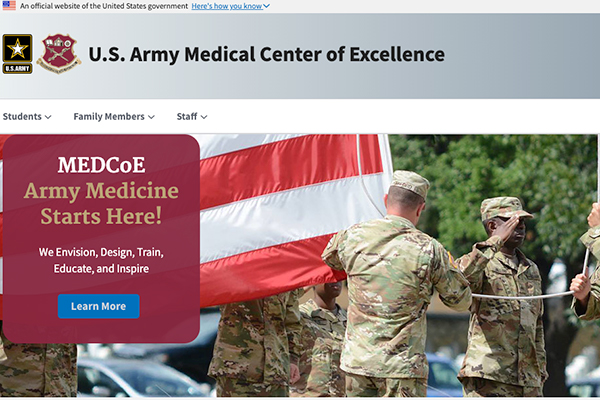
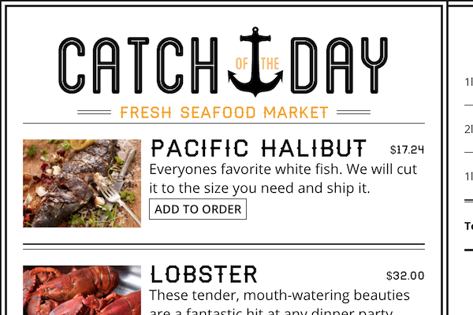
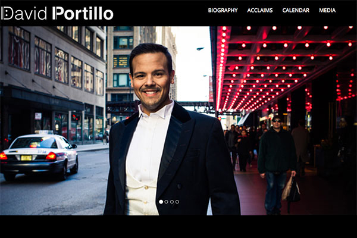
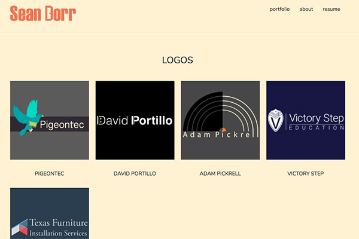
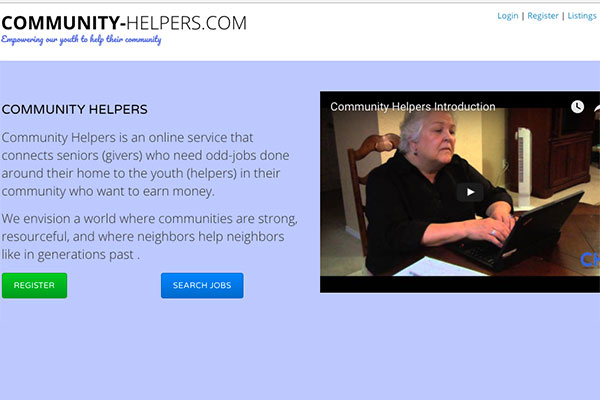
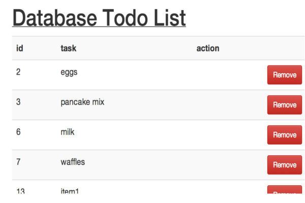
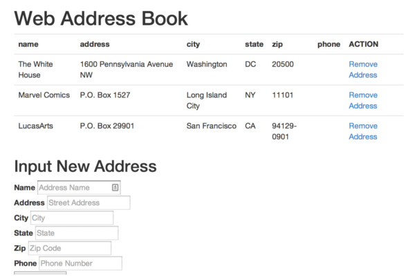
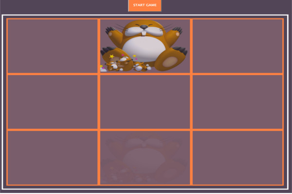
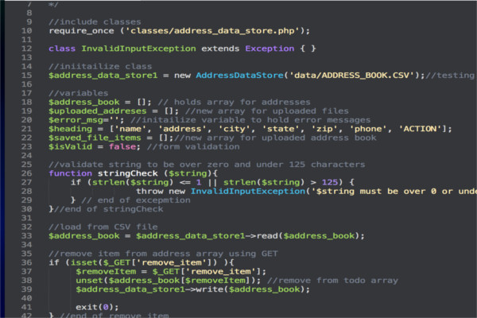

## U.S. Army Medical Center of Excellence

Redesigned the U.S. Army MedCoE public page using the [United States Web Design System (USWDS)](https://designsystem.digital.gov/). The website was the winner an [Web Award for web development](http://www.webaward.org/winner/35327/pigeon-frank-s-jr--verastigui-hector-a-young-stephanie-a-bailey-james-e-cardwell-loretta-b-castillo-paul-engler-timothy-l-gilbert-nancy-j-fox-matthew-d-wins-2019-webaward-for-army-medical-department-center--school-hrcoe.html). Built with .NET and the USWDS.

[View Live][medcoe]

## College Of Biomedical Equipment Technology

Client work redesigning the education site for the College Of Biomedical Equipment Technology with modern look, latest tech stack, and hardening the security of the site. Built with Gatsby, React, custom Google Sheets, and Microsoft Azure.

[View Live][cbet]

## Catch of the Day

Real-time web application for a fictional trendy seafood market where price and quantity available can change at a moment's notice. Includes a build a menu, an order form, and an inventory management area where authorized users can immediately update product details. Built with React, ES6, React Router 4, and Firebase.

[View Github][cotd-gh]

## David Portillo Tenor

Client work for opera singer David Portillo. Web Design and development that includes a calendar of upcoming perfomances, media gallery, acclaims, and biography pages. Built with Jekyll and hosted on Github.

[View Github][david-portillo-gh]  
[View Live][david-portillo-live]

## Sean Dorr Portfolio

Client work for graphic artist and designer Sean Dorr's portfolio website. Web Design and Development. Built with Jekyll and hosted on Github.

[View Github][sean-dorr-gh]  
[View Live][sean-dorr-live]

## Community Helpers

Web application that connects seniors that need work done around their home and the youth that want to earn some extra money. Built using Laravel, PHP, MySQL, JavaScript, jQuery, and Twitter Bootstrap. Development done in a Vagrant environment. Version control using Git and GitHub. Features a helper/giver dashboard, a job listing for helpers to apply to, and giving the power to the giver to select a helper based on their jobs completed and reviews.

[View Github][community-helpers-gh]  

## Todo List

The application was built using PHP, MySQL, HTML and CSS and it allows for adding new items, removing completed items, and uploading a todo list.

[View Github][todo-gh]

## Address Book

The application was built using PHP, MySQL, HTML and CSS and it allows for adding new addresses, removing completed addresses, and uploading an exisiting address book.

[View Github][address-book-gh]

## Whack-A-Mole

First-person video game based on the classic whack-a-mole game. The game randomly has moles pop out of holes and the object of the game is to hit the moles and have them go back in their hole. The application features the ability to keep score, maintain a high-score, and a countdown timer. Written in PHP, JavaScript, and jQuery.

[View Github][whack-a-mole-gh]

## High Low game

The game picks a random number between 1 and 100. It prompts the user to take a guess and outputs higher, lower, or good guess. Written in PHP.

[View Github][highlow-gh]

## Fizz Buzz

The application prints the numbers from 1 to 100. But for multiples of three print “Fizz” instead of the number and for the multiples of five print “Buzz”. For numbers which are multiples of both three and five print “FizzBuzz”. Written in PHP.

[View Github][fizzbuzz-gh]

## CS Classwork

Check out my project exercises for the Computer Science courses I completed at Regis University. Written in C++.

[View Github][cs-gh]

[cotd-gh]: https://github.com/fpigeonjr/reactForBeginners
[cotd]: http://catch-of-the-day.pigeontec.com
[david-portillo-gh]: https://github.com/davidportillo/tenorwebsite
[david-portillo-live]: http://davidportillotenor.com
[sean-dorr-gh]: https://github.com/seandorr/designer-portfolio
[sean-dorr-live]: http://seandorr.com/
[community-helpers-gh]: https://github.com/fpigeon/blog.dev
[community-helpers-live]: http://community-helpers.com
[todo-gh]: https://github.com/fpigeon/Web_Todo_List
[address-book-gh]: https://github.com/fpigeon/Codeup_Web_Exercises/blob/master/public/address_book.php
[whack-a-mole-gh]: https://github.com/fpigeon/Codeup_Web_Exercises/blob/master/public/whack.html
[highlow-gh]: https://github.com/fpigeon/High_Low
[fizzbuzz-gh]: https://github.com/fpigeon/CodeUp_Exercises/blob/master/fizzbuzz.php
[cs-gh]: https://github.com/fpigeon/Regis-University-CS-classwork
[medcoe]: https://www.cs.amedd.army.mil
[cbet]: https://cbet.edu
