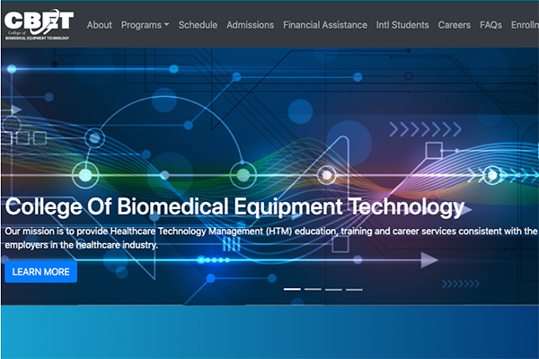

## Benefits Eligibility Awareness Resource for USAGov

Front end development and user interface design for the Benefits eligibility estimator tool for USAGov. Built with Vue, Nuxt, Vuex, search.gov, and the United States Web Design System (USWDS).

[View Live](https://benefits-tool-beta.usa.gov/)  
[View Github](https://github.com/GSA/usagov-benefits-eligibility)

## USWDS Together Report

Helped with design and front end development for the United States Web Design System (USWDS) Together Report as part of the USWDS 3.3.0 rollout. Built with Jekyll, SASS, USWDS, and hosted on Pages from Cloud.gov.

[View Live](https://designsystem.digital.gov/together/)  
[View Github](https://github.com/uswds/uswds-site/)

## Federal Risk and Authorization Management Program (FedRAMP) Automation

Helped with design and front end development for ASAP. Built with TypeScript, React, SASS, USWDS, and hosted on Pages from Cloud.gov.

[View Live](https://federalist-b6c4d61f-facd-4833-a4a9-554523a87147.sites.pages.cloud.gov/site/gsa/fedramp-automation/)  
[View Github](https://github.com/18F/fedramp-automation/)

## AMEDD Center of History & Heritage

Redesigned the AMEDD Center of History & Heritage website using the [United States Web Design System (USWDS)](https://designsystem.digital.gov/). Built using Gatsby, .NET API, search.gov, and the USWDS.

[View Live][achh]

## Borden Institute

Redesigned the Borden Institute website using the [United States Web Design System (USWDS)](https://designsystem.digital.gov/). The website was the winner an [Web Award for Best Retail Website](http://www.webaward.org/winner/35795/g6-business-technology-solutions--wins-2020-webaward-for-borden-institute.html). Built using Gatsby, .NET API, and the USWDS.

[View Live][borden]

## U.S. Army Medical Center of Excellence

Redesigned the U.S. Army Medical Center of Excellence (MEDCoE) public page using the [United States Web Design System (USWDS)](https://designsystem.digital.gov/). The website was the winner an [Web Award for web development](http://www.webaward.org/winner/35327/pigeon-frank-s-jr--verastigui-hector-a-young-stephanie-a-bailey-james-e-cardwell-loretta-b-castillo-paul-engler-timothy-l-gilbert-nancy-j-fox-matthew-d-wins-2019-webaward-for-army-medical-department-center--school-hrcoe.html). Built using Gatsby, .NET API, and the USWDS.

[View Live][medcoe]

## Threads of Love For Heaven's Sake

Client work designing the non-profit website for the Threads of Love For Heaven's Sake San Antonio Chapter. Designed and developed from client's paper brochure to fully functional site with donations. Built with Gatsby, React, custom Google Sheets. Hosted on Netlify.

[View Live][tol]  
[View Github](https://github.com/sacodersunited/threads-of-love)

## College Of Biomedical Equipment Technology

Client work redesigning the education site for the College Of Biomedical Equipment Technology with modern look, latest tech stack, and hardening the security of the site. Built with Gatsby, React, custom Google Sheets, and Microsoft Azure. Hosted on Netlify.

[View Live][cbet]  
[View Github](https://github.com/sacodersunited/cbet)

## David Portillo Tenor

Client work for opera singer David Portillo. Web Design and development that includes a calendar of upcoming performances, media gallery, acclaims, and biography pages. Rebuilt in 2021 using Strapi backend and Gatbsy on the frontend.

[View Github][david-portillo-gh]  
[View Live][david-portillo-live]

## Sean Dorr Portfolio

Client work for graphic artist and designer Sean Dorr's portfolio website. Web Design and Development. Built with Jekyll and hosted on Github.

[View Github][sean-dorr-gh]  
[View Live][sean-dorr-live]

## Catch of the Day

Real-time web application for a fictional trendy seafood market where price and quantity available can change at a moment's notice. Includes a build a menu, an order form, and an inventory management area where authorized users can immediately update product details. Built with React, ES6, React Router 4, and Firebase.

[View Github][cotd-gh]

## Community Helpers

Web application that connects seniors that need work done around their home and the youth that want to earn some extra money. Built using Laravel, PHP, MySQL, JavaScript, jQuery, and Twitter Bootstrap. Development done in a Vagrant environment. Version control using Git and GitHub. Features a helper/giver dashboard, a job listing for helpers to apply to, and giving the power to the giver to select a helper based on their jobs completed and reviews.

[View Github][community-helpers-gh]  

[cotd-gh]: https://github.com/fpigeonjr/reactForBeginners
[david-portillo-gh]: https://github.com/sacodersunited/portillo-tenor
[david-portillo-live]: http://davidportillotenor.com
[sean-dorr-gh]: https://github.com/seandorr/designer-portfolio
[sean-dorr-live]: http://seandorr.com/
[community-helpers-gh]: https://github.com/fpigeon/blog.dev
[community-helpers-live]: http://community-helpers.com
[medcoe]: https://medcoe.army.mil
[cbet]: https://cbet.edu
[borden]: https://medcoe.army.mil/borden
[achh]: https://achh.army.mil/
[tol]: https://threadsoflovesatx.org
