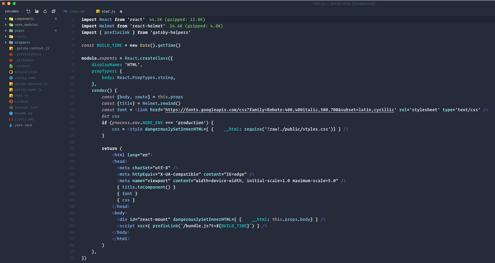
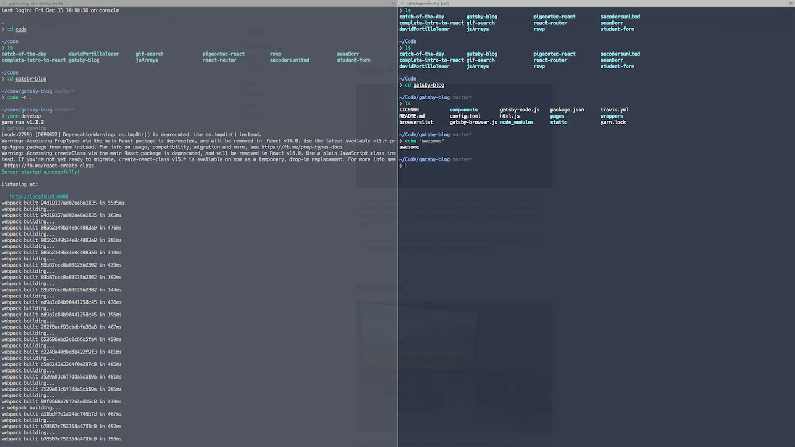
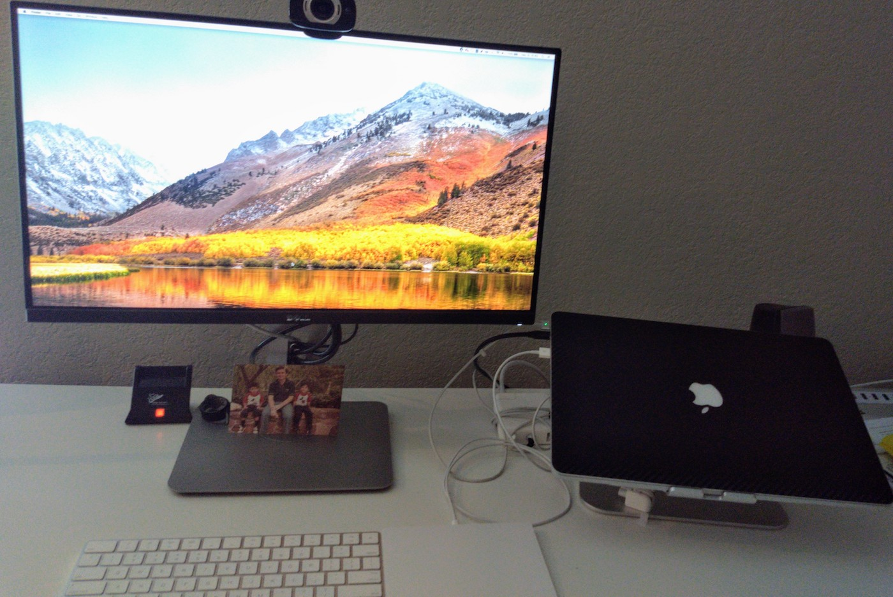

## Editor + Terminal

I have been using [Visual Studio Code][visual studio code] as my code editor for over a two years now and have been very happy with it. Probably my favorite electron app by far. My favorite color themes are [Cobalt2][cobalt2], [Dracula][dracula], [Material Facebook][material facebook]. My favorite font is [Dank Mono][dank mono].

For my terminal, I have stuck with [iTerm2][iterm2]. It is reliable, customizable, and just works. I go fullscreen with a slight transparency. I also use [oh-my-zshell][oh-my-zsh], [pure-prompt][pure], with the [facebook theme][facebook-iterm]. I played around with Hyper but had some issues so I switched back.

## Hardware

Bought my first macintosh due to it being a requirement for my [coding bootcamp][codeup]. It is a [2012 15" retina macbook pro][mac] sitting ontop of a [Rain Laptop Stand][rain-stand]. This has been my workhorse ever since I started coding and really enjoy working on mac. It is the closest we can get to linux but still having access to apps like Adobe's Creative Cloud.

I recently sold my dual monitor setup and replaced it with a single [Dell UltraSharp U2515H 25-Inch Monitor][dell-monitor] after reading [A Single Monitor Manifesto][manifesto] by [Cory House][cory-house]. It made a lot sense to me and am happy with the new setup. This new setup helps me stay focused on the task at hand and avoid distractions.

I own a [Logitech HD Laptop Webcam C615][webcam] for webchats and music recordings.

## Other

I use [Google Keep][keep] for my daily todos and started journaling in a private repo in Github.

I use [Trello][trello] for project management tasks for any given project.

My team uses [Slack][slack] for office communications. The goal being that email is for external customers.

I use [OpenDNS][opendns] to filter content and improve network speeds.

I built a [Raspberry Pi][rpi] using [pi-hole][pihole] to filter ads and have also setup [openvpn][openvpn] to secure traffic when I'm out in the wild.

I also setup a [Disney's Circle][circle] which is an amazing device that helps keep time limits on our children's internet time.

[visual studio code]: https://code.visualstudio.com/
[codeup]: http://codeup.com
[monokaipro]: https://www.monokai.pro/vscode/
[material facebook]: https://github.com/rmarganti/vsc-material-facebook-theme
[dracula]: https://draculatheme.com/visual-studio-code/
[cobalt2]: https://github.com/wesbos/cobalt2-vscode
[iterm2]: https://www.iterm2.com/
[pure]: https://github.com/sindresorhus/pure
[facebook-iterm]: https://github.com/slwen/facebook-iterm-theme
[oh-my-zsh]: https://github.com/robbyrussell/oh-my-zsh
[operator mono]: https://dank.sh/
[dell-monitor]: https://www.amazon.com/dp/B00SPWPF1O/_encoding=UTF8?coliid=I2CTU0GMXJ7G9U&colid=1SW4HY14FLX9F&psc=0
[cory-house]: https://twitter.com/housecor
[manifesto]: https://hackernoon.com/why-i-stopped-using-multiple-monitors-bfd87efa2e5b
[webcam]: http://a.co/1F7pfgq
[circle]: http://a.co/cbymmBu
[keep]: https://keep.google.com/
[trello]: https://trello.com/
[slack]: https://slack.com/
[opendns]: https://www.opendns.com
[mac]: https://support.apple.com/kb/sp653?locale=en_US
[rain-stand]: http://a.co/e4cHHEA
[rpi]: https://www.raspberrypi.org/
[openvpn]: https://openvpn.net/
[pihole]: https://pi-hole.net/
[dank mono]: https://dank.sh/