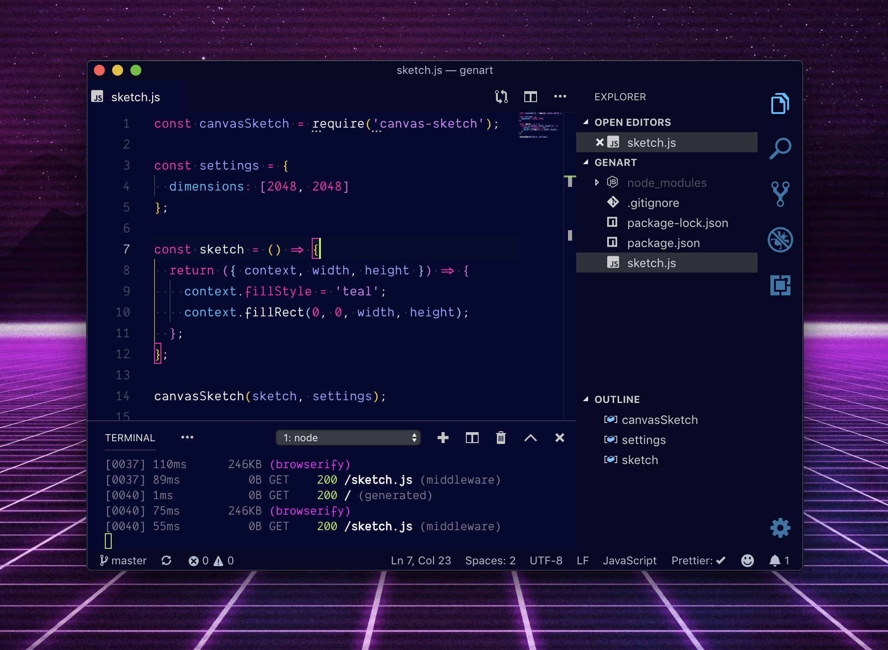
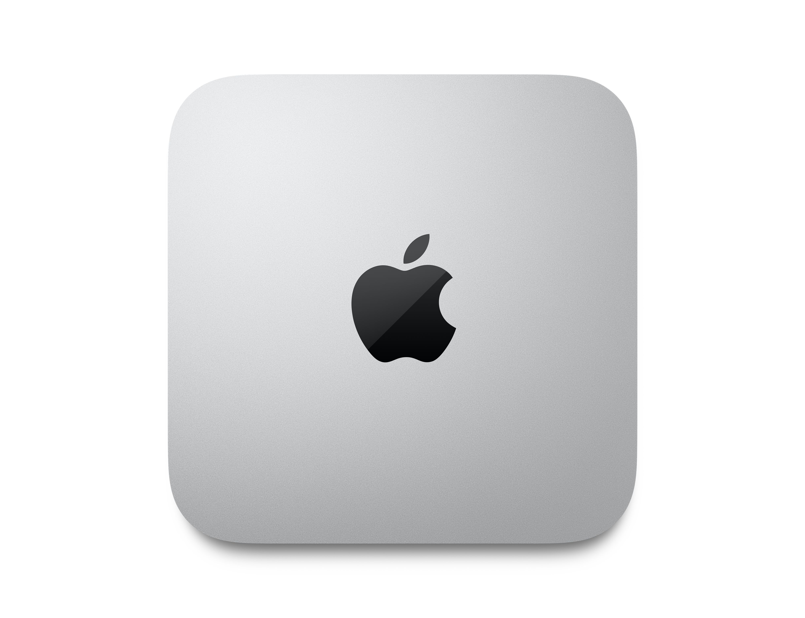

## Code Editor + Terminal

I have been using [Visual Studio Code][visual studio code] as my code editor for over a four years now. I recently switched to the insiders build since it always has some newer features like **settings sync** and **github integrations**.

> ❤️ Probably my favorite electron app by far.

My favorite color themes are [1984](https://github.com/juanmnl/vs-1984), [Moonlight](https://github.com/atomiks/moonlight-vscode-theme), and [Night Owl](https://github.com/sdras/night-owl-vscode-theme).

My favorite fonts are [hasklig](https://github.com/i-tu/Hasklig) and [recursive variable font](https://github.com/arrowtype/recursive).

- hasklig examples

For my terminal, I have stuck with [iTerm2][iterm2] when on mac. It is reliable, customizable, and just works. I go fullscreen with a slight transparency. I also use [oh-my-zshell][oh-my-zsh], [pure-prompt][pure], with the [facebook theme][facebook-iterm].

## Hardware

### Desktop

**[2020 MacMini](https://smile.amazon.com/2020-Apple-Mini-256GB-Storage/dp/B08N5PHB83/ref=sr_1_5?dchild=1&keywords=macmini&qid=1624923395&sr=8-5)**

- Apple M1 chip with 8‑core CPU, 8‑core GPU, and 16‑core Neural Engine
- 8GB unified memory
- 256GB SSD storage
- Gigabit Ethernet

### Laptop

Using an iPad when I am on the go. Combine with a [Smart Keyboard](https://smile.amazon.com/dp/B08635GZ8H/ref=cm_sw_em_r_mt_dp_696T9DXND4JG7KW0HDBZ) when thing get serious.

### Monitor

I am now on #teamcrispy with my LG 27UK850-W 27" 4K UHD IPS Monitor. 4K is a dream and text and images look really sharp.

Inspiration for the setup is from [A Single Monitor Manifesto][manifesto] by [Cory House][cory-house]. It made a lot sense to me and am happy with the new setup. This new setup helps me stay focused on the task at hand and avoid distractions.

## Other Honorable Mentions

- Bullet Journal in a crappy notebook.

- Github for project management tasks for any given project.

- MS Teams for office communications.

- [Cloudflare for Families](https://blog.cloudflare.com/introducing-1-1-1-1-for-families/) to filter content and improve network speeds.

- [Raspberry Pi][rpi] using [pi-hole][pihole] to filter ads on my network.

- [Nord VPN][nordvpn] to secure traffic when I am out in the wild.

- [Disney's Circle][circle] keeps time limits, bed times, and filters on our children's internet.

[visual studio code]: https://code.visualstudio.com/
[codeup]: http://codeup.com
[monokaipro]: https://www.monokai.pro/vscode/
[material facebook]: https://github.com/rmarganti/vsc-material-facebook-theme
[dracula]: https://draculatheme.com/visual-studio-code/
[cobalt2]: https://github.com/wesbos/cobalt2-vscode
[iterm2]: https://www.iterm2.com/
[pure]: https://github.com/sindresorhus/pure
[facebook-iterm]: https://github.com/slwen/facebook-iterm-theme
[oh-my-zsh]: https://github.com/robbyrussell/oh-my-zsh
[operator mono]: https://dank.sh/
[dell-monitor]: https://www.amazon.com/dp/B00SPWPF1O/_encoding=UTF8?coliid=I2CTU0GMXJ7G9U&colid=1SW4HY14FLX9F&psc=0
[cory-house]: https://twitter.com/housecor
[manifesto]: https://hackernoon.com/why-i-stopped-using-multiple-monitors-bfd87efa2e5b
[webcam]: http://a.co/1F7pfgq
[circle]: http://a.co/cbymmBu
[trello]: https://trello.com/
[slack]: https://slack.com/
[opendns]: https://www.opendns.com
[mac]: https://support.apple.com/kb/sp653?locale=en_US
[rain-stand]: http://a.co/e4cHHEA
[rpi]: https://www.raspberrypi.org/
[pihole]: https://pi-hole.net/
[cascadia-code]: https://github.com/microsoft/cascadia-code
[nordvpn]: https://go.nordvpn.net/aff_c?offer_id=15&aff_id=3363&url_id=902
