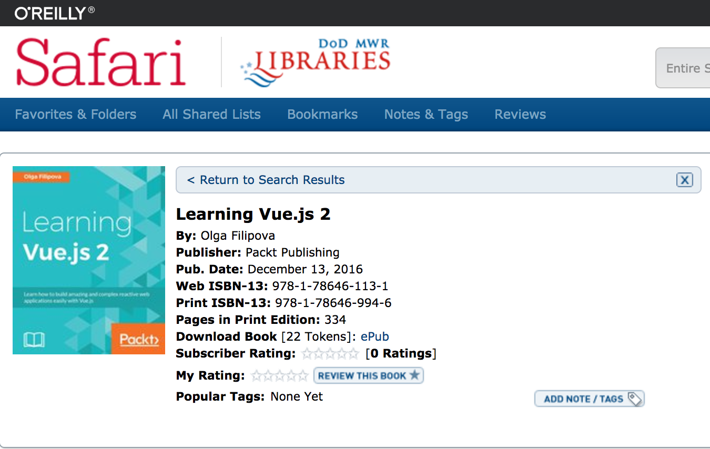

## Learning Javascript in 2017

Getting started on my goal to learn more Javascript in 2017, I decided to start my adventure with React.

Having completed a couple tutorials, I was feeling pretty excited about React, its ecosystem, and its popularity in the Javascript world.

One of my concerns was am I investing in the right Javascript framework? How do you know you are picking the right one when you haven't experienced them all.

> My mentors told me that you just need to pick one and go with it.

I was feeling a little fuzzy on my React training so launching this blog using React help solidy some of that knowledge.

## And then there was Vue

Jeffrey Way had released a free series on [Vue.js][vue] that had perked my interest. I feel that he is a great teacher and I have been a subscriber to [Laracasts][laracasts] for a long time.

I wanted a break from React and was curious on how it would be to build something using Vue.

Right away I fell in love.

There is no complicated setup. All you do is drop in one javascript tag and you are ready to go. No fancy setup required.

```js
<script src="https://unpkg.com/vue" />
```

Next, you'll want to setup your template.

#### html

```html
<div id="app">{{ message }}</div>
```

#### javascript

```javascript
var app = new Vue({
  el: '#app',
  data: {
    message: 'Hello World',
  },
})
```

Congrats you have just setup your first Vue app. We are telling Vue to connect to the id `app` and then we are passing in the data `message` using the mustache syntax `{{ message }}`.

Vue.js is simple to work with and just makes sense. There is a clear separation from your markup, your logic, and styling. Contrasting React's JSX, everything was jumbled up in there.

Bonus: It doesn't hurt that you have one of the best teacher's with Jeffrey Way. I really recommend his free Vue.js 2 course entitled [Learn Vue 2: Step By Step][laracast-vue].

After completing the course I was so excited to learn more about Vue that I started reading a book named [Learning Vue.js 2][book] by Olga Filipova.



This book was listed as one the resources from the [Awesome Vue][awesome-vue] Github repo that has tons of Vue related resources.

## Changing Teams

So now I have changed teams from React to Vue.

My mentor says that either one you chose it will help you further your Javascript learning so these are in line with my professional goals.

## Wrapping Up

I am enjoying the book so far and am excited to learn Vue deeper. I am typically a visual learner but it is refreshing going **old school** and reading an ebook. So far I have completed Chapter 2 and have learned a bunch so far. Some of the exercises are creating a Shopping List and a Pomodoro timer. I think you will enjoy learning and using Vue.js in your projects too.

[vue]: https://vuejs.org/
[laracasts]: https://laracasts.com/
[laracast-vue]: https://laracasts.com/series/learn-vue-2-step-by-step
[awesome-vue]: https://github.com/vuejs/awesome-vue
[book]: https://www.packtpub.com/web-development/learning-vuejs-2
