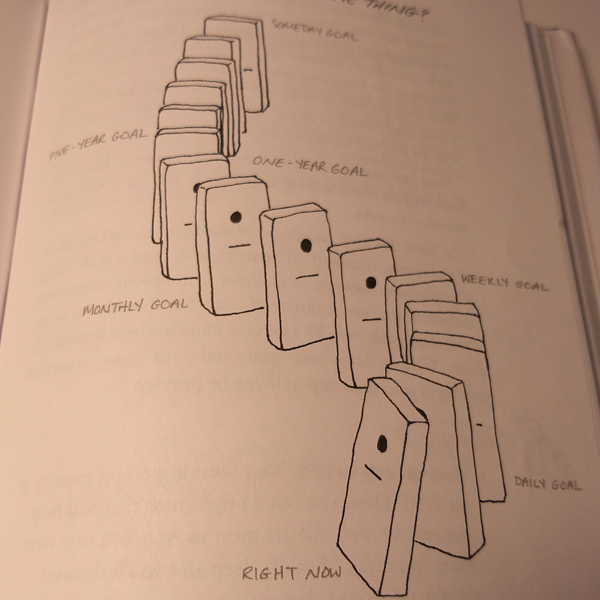
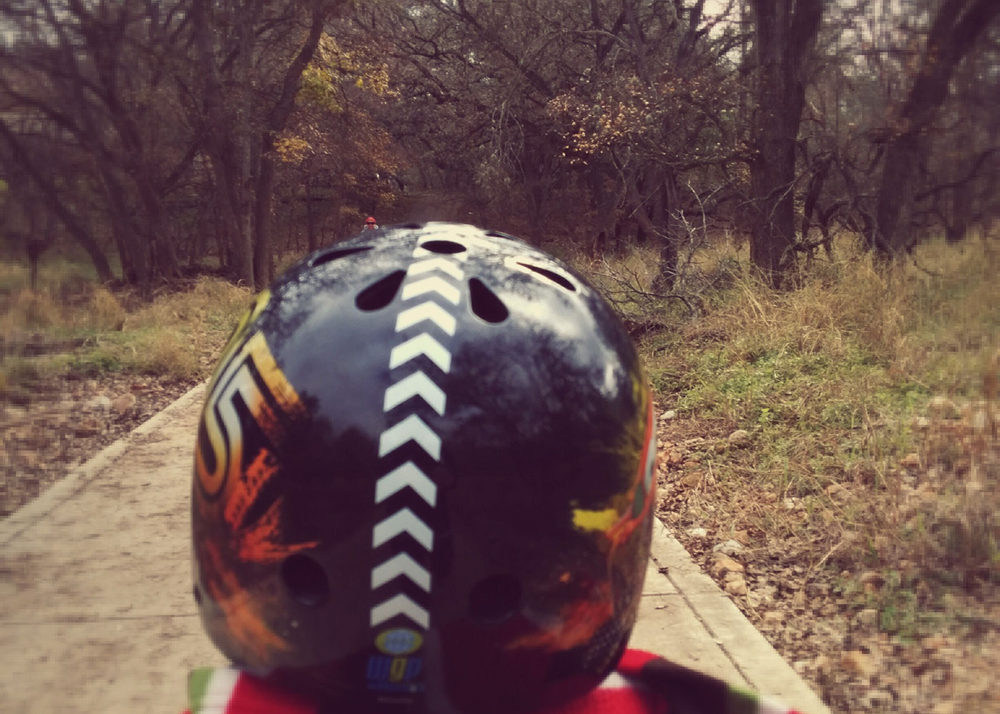

## Intro

I have started reading books in 2018 and found a lost love I once had from high school. I saw a video from Dain Miller entitled **"How to Improve as a Programmer - DON'T WRITE MORE CODE, READ MORE"**.

<section>
  <iframe class="lost-center" width="560" height="315" src="https://www.youtube-nocookie.com/embed/moTlZBY66Ng?rel=0&amp;showinfo=0" frameborder="0" allow="autoplay; encrypted-media" allowfullscreen></iframe>
</section>

After watching this inspirational video I was motivated to start the path to reading more, sleeping more, unplugging more, and being more focused and productive.

I am currently reading **"The One Thing: The Suprisingly Simple Truth Behind Extraordinary Results"** by Gary Keller.

This book is full of wisdom, productivity hacks, and lays out a plan to get extraordinary results written by the chairman of the board and cofounder of Keller Williams Realty, Inc. So this is one of the sources of inspiration for this post.

<figure>
<blockquote>
  
What is the <em>One Thing</em> I can do such that by doing it everything else will be easier or unneccesary?

</blockquote>
</figure>

## Read More

I want to read 12 books in 2018. This comes out to one book a month.

I recently bought a used Kindle that I am hoping will help me with this goal. The reason I didn't go with a tablet is that the Kindle is a dedicated reader. No social media, apps, etc to distract me.

### Book List for 2018

- **The Obstacle is the Way** by Ryan Holiday
- **The One Thing** by Gary Keller
- **Deep Work** by Cal Newport
- **Anything You Want** by Derek Silvers
- **12 Rules for Life: An Antidote for Chaos** by Jordan Peterson
- **The Pragmatic Programmer: From Journeyman to Master** by Andy Hunt
- **Clean Code: A Handbook of Agile Software Craftsmanship** by Robert C. Martin
- **The Selfish Gene** by Richards Dawkins
- **Influence: The Psychology of Persuasion** by Robert B. Cialdini
- **Bold: How to Go Big, Create Wealth and Impact the World** by Peter H. Diamandis
- **The Happiness Hypothesis: Finding Modern Truth in Ancient Wisdom** by Jonathan Haidt
- **The Introvert Advantage: How to Thrive in an Extrovert World** by Marti Olsen Laney

## Spiritual Life

Attend church weekly and attend a bible study. This is a great way to start off the week by putting God first and setting a good example for my boys. Read my bible every day before bed.

## Physical Health

Hit the gym three times a week and sleep 8 hours a day. I pack my gym bag the night before so I have no excuses to not go. I am following Carl Yung's habit of going to bed by 10pm and waking up by 7am and starting out the day in _Deep Work_. Afternoons are for _Shallow Work_ (everything else). Evenings are for family time. Internet goes down by 10pm and phone is on _Do Not Disturb_ mode.

## Personal Life

Plan a family outing and date night once a month.

<figure>
<blockquote>
  
 Families who sweat together stay together

</blockquote>
</figure>

## Professional

In 2017 I started my journey learning Javascript and in 2018 I will continue this journey.

Currently enrolled in Udacity's React Nano Degree. This covers React, Redux, and React Native.

After completing the Nano Degree in by this Spring, I will be focusing on the following **Frontend Masters** courses for Summer and Fall.

- Complete Intro to React, v3 (feat. Redux, Router & Flow)
- Advanced State Management in React (feat. Redux and MobX)
- Firebase + React: Real-time, Serverless Web Apps
- React Native (feat. Redux)
- Testing JavaScript Applications (feat. React and Redux)

I also have queued up Kyle Simpons' **You Don't Know JS** series on my Kindle.

## Financial

As a Dave Ramsey follower, we are on Baby Step 2 of **The Total Money Makeover**. We had a lot of life thrown at us in 2017 and we are working on paying down debt, sticking to a monthly zero-based budget, and a cash envelope system to help us stay on track. Old school but effective.

## Conclusion

Blogging and writing more is also important to me so my goal will be one blog post a month.

🤔 Writting down your goals are key to keeping them so maybe blogging them will be just as effective.
