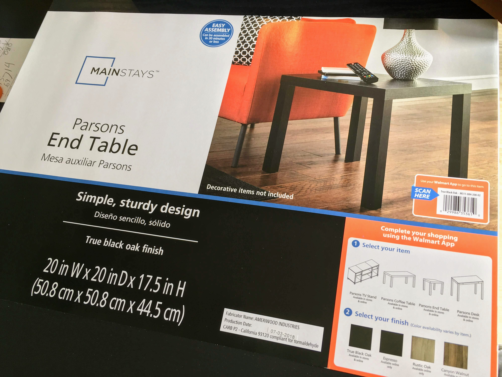
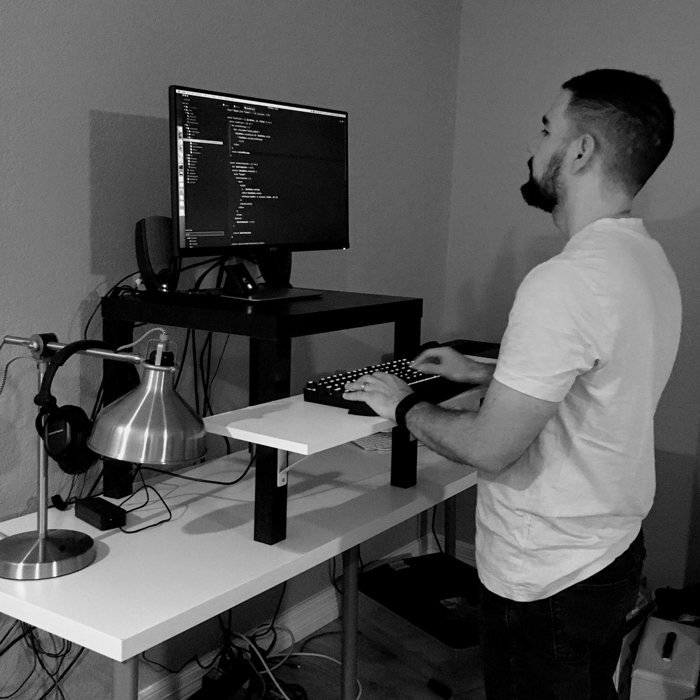

## Inspiration

I have been considering building a standing desk on the cheap. [I read an article where you can get all the parts from Ikea like for \$20 bucks](http://iamnotaprogrammer.com/Ikea-Standing-desk-for-22-dollars.html) and just make your own. The [official Veridesk ones](https://www.amazon.com/VARIDESK-Height-Adjustable-Standing-Desk-Pro/dp/B00BBFXBF4) are like a grand and even the one that you put on top of your existing desk runs \$300. So yeah, not in my budget at all. Probably need a stool kinda thing in case I get tired standing as well, the veridesk one is insane.

## Standing Desk Build

I've been wanting a standing desk for some time but was always put off since it was so expensive. I have a regular siting desk for many years but since we got Veridesk at work I've enjoyed the health benefits and been wanting one for my home office as well.

So I looked around and found that there was an Ikea hack where you could build your own for ~$20. I was so happy that I wanted to see if I could pull it off. If it didn't work out it was just $20 bucks and little bit of my time so no biggie.

Another problem I faced was that the pieces were from Ikea but the closest one is in Austin which is ~ 2hrs drive. _I didn't feel like spending 4 hours in the car to I could save a few bucks_.

So while we were at Walmart looking around, I took a look around to see if I could find similar materials to make the standing desk.

### Materials

- [ ] [end table(monitor stand), \$12](https://www.walmart.com/ip/Mainstays-Parsons-End-Table-Multiple-Colors/47827019)
- [ ] shelf(keyboard and mouse), \$6
- [ ] brackets(to put them together), \$5

I found a end table in Walmart's furniture isle. I had a harder time finding the shelf but eventually found it in the tools/hardware area in the closet organizer area. Brackets were also located right next to the shelf since it was the same brand.

## Bonus

You will eventually get tired of standing so there are some bonus items you can get that will make your standing desk more standing friendly.

- [ ] [anti-fatigue mat](https://www.samsclub.com/sams/comfort-mat-20-x-39-black/prod20640234.ip), \$20
  - I found the anti-fatigue mat at Sams in the office furniture area. It is of good quality and really does help your feet stay happy at your standing desk.
- [ ] stool, \$22
  - So you can't stand forever and too much of a good thing is never good so I also invested in a stool so when I do get tired I can sit and still be high enough to take advantage of the standing desk.

## Conclusion

So far I am very happy with the results, glad I didn't have to spend a fortune, and also leaned into my hacker tendencies. We'll see if it holds up but if it doesn't, I can always build another one #onthecheap.
