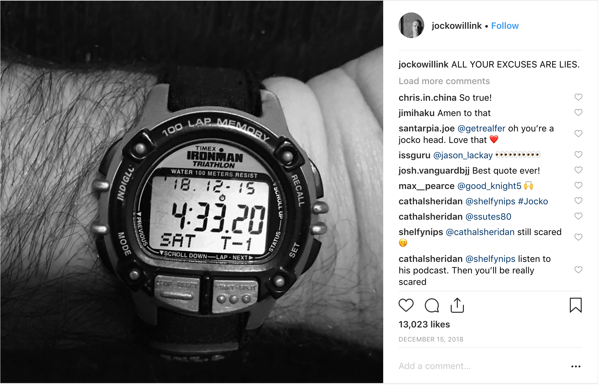

## 🎉 2018! What a Year It Has Been

> Proverbs 16:9 A man’s heart plans his way, but the Lord directs his steps.

2018 has been a year full of challenge, growth, blessings, and heartache. Knowing that one must love their fate I wouldn't change a thing. God has a plan and I have no choice but to trust in Him.

## Reflections on 2018

While there was so much win in 2018, this is a list of my **Top Favorite 8 Things from 2018**.

### 1. Waking Up Early

<iframe width="560" height="315" src="https://www.youtube.com/embed/C-Cvl3_CH2A" frameborder="0" allow="accelerometer; autoplay; encrypted-media; gyroscope; picture-in-picture" allowfullscreen></iframe>

I have heard that many of the most successful people in the world wake up early. The idea is that if you wake up early you can get to your most important work early when you are at your best.

Also waking up early requires discipline, and once you start the day with disciple it carries on with you the rest of the day.

> 💪there is even a club of early risers, the #430 club!

I started thinking about how I could apply this to my life and decided to change my work schedule to see if it could work for me. I decided to change my schedule from five regular 8 hour days to four 10 hour days.

- Mon- 🔥Regular Day Off
- Tues - 10 hours
- Wed - 10 hours
- Thurs - 10 hours
- Fri - 10 hours

I was reflecting before deciding on this schedule that when the boys were young this wouldn't be possible. I was in charge of getting the youngest Pigeon to daycare.

> 🌈 every weekend is a three day weekend

So yes _they are long 10 hour days_, but I get a day off every week. I love what I do so that helps make the day go by when you are passionate about your work, the process, the challenge. Especially when you are a knowledge worker you need long blocks of time to go deep into what you are working on. As explained in the concept of maker's schedule vs manager schedule, as a maker, we see our days in 4-hour blocks of time.

### 2. Habit Tracking

Right as I was getting started with the waking up early habit, I was also reading the book **Atomic Habits** by [James Clear](https://jamesclear.com/).

This is a great book, definitely one of my favorites of 2018, and it is about how to ditch bad habits and form good ones.

James gives you solid examples on how to go about this process and also has a lot of research, science, and stories from history.

One my favorite parts is to track your habits. [I found a great tool by Sean Wes that helps track 5 habits](https://seanwes.com/five-habit-tracker-template/).

My five habits that I am tracking are:

1. Wake up early(430-530)
2. Journal
3. Read a Bible Chapter
4. 10K Steps
5. Read 30 mins

### 3. Keto Diet + IF(Intermittent Fasting)

<iframe src="https://open.spotify.com/embed/episode/3CLIfzgplNxG5UeSHPbvkK" width="300" height="200" frameborder="0" allowtransparency="true" allow="encrypted-media"></iframe>

In the fall, I noticed that work pace was increasing, I stopped going to the gym, and I was putting on some weight.

To make things worse, I was going into see my doctor in November for my biannual checkup. I didn't want to get yet another bad report this year for being overweight and not in the normal range for my BMI.

I heard a podcast from one of my favorite podcasts, Syntax, where both the hosts were sharing their fitness tips and diets. They were both on the Keto diet and loved it. So that peaked my curiosity then I found this video from Dr. Eric Berg.

<iframe width="560" height="315" src="https://www.youtube.com/embed/AnyFVWwzgJI" frameborder="0" allow="accelerometer; autoplay; encrypted-media; gyroscope; picture-in-picture" allowfullscreen></iframe>

I tried it and fell in love. I like meats like bacon, sausage, eggs, nuts, and salads.

> Oversimplifying it, all keto is = 🦃 meats and 🥗 greens and saying no to 🚫 carbs and sugar.

Before starting keto, I weighed 165 lbs and two months in dropped 20 pounds.

**The IF part is important too**. All that it means is that I have a 8 hour window to eat, and then I fast the other 16 hours.

For me it means that I eat from (10a - 6p), or (12p - 8p), depending on when I eat lunch.

There are many health benefits of fasting like, better focus, discipline, increased energy, and improved fat burning.

> 🔥 (IF) is the secret sauce to weight loss and when combined with keto

### 4. Minimalism

As a minimalist at heart, the holidays are always tough since we bring in so many things to our home. To keep things in balance, I try hard to either sell things or give them away if they no longer bring any value to my families lives.

> I have had pretty good luck selling things locally with Facebook Marketplace.

It's not totally random people like on craigslist, at least you have a name and face. Also, FB Marketplace has a rating system so if you have a bad experience you can protect the community with ratings.

[This is a great episode of **Coffee with Sean and Ben** where they discuss this topic](https://seanwes.com/podcast/389-the-ebay-show-turn-stuff-around-your-house-into-cash/).

### 5. Health

Along with my new diet, I also wanted to exercise more so I can be a healthier, well-balanced person.

I invested in an Apple watch which helps track my progress and love the Activity App that helps track your workouts, heart rate, achievements, and steps.

The idea behind the Activities App is to close your rings every day.

[The rings represent **Move**, **Exercise**, and **Stand**](https://www.apple.com/watch/close-your-rings/).

### 6. Minnesota Trip

This summer we got to visit my brother-in-law in Minnesota. It was a two day drive straight up I35. The boys are older now so it made for an easier trip.

We had a lot fun visiting family and exploring all the Minnesota had to offer.

We had fun on the lakes, biking, saw the Mall of the Americas, and eating ice cream.

### 7. Raspberry Pis For Kids

As a web developer, I wanted to share my love of coding with my boys and I wanted to do it on the cheap.

The solution was to build Raspberry Pis for them and start to teach them Scratch.

My boys enjoy the visual way Scratch teaches programming concepts and then get to show off their project to their mom when they are finished.

> ❤️ I am a proud papa

### 8. Driving for Uber

In the Spring of 2018, I was looking to make some extra cash on the side and found a way to do it that was flexible enough for my schedule.

I work close to downtown so after work I would go to downtown San Antonio and give people rides. Most were friendly people who just needed to get from a conference to the airport or out to eat.

I was lucky enough to drive during Spurs games, the Final Four, and Fiesta which were great times to work.

## Looking Forward To 2019

I am exited to see what God has in store for 2019. Look out for a blog post soon for my goals (habits) for 2019!
