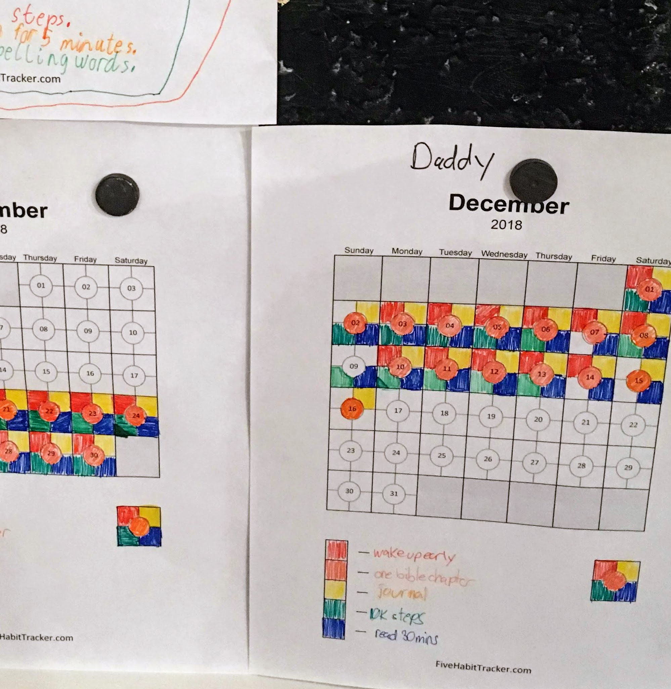
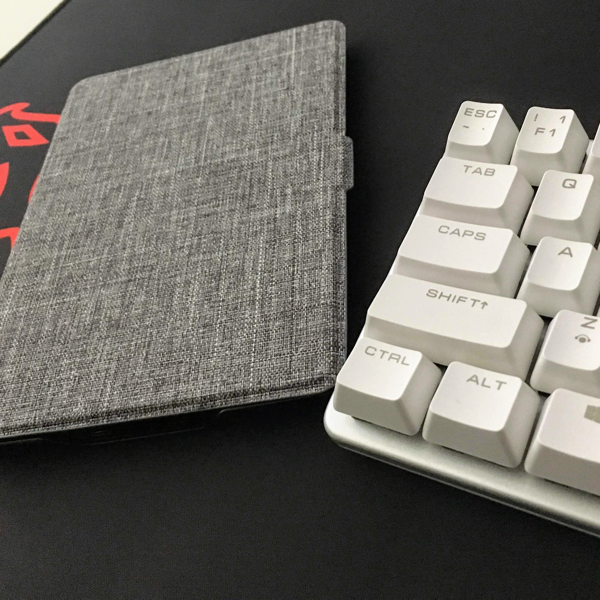
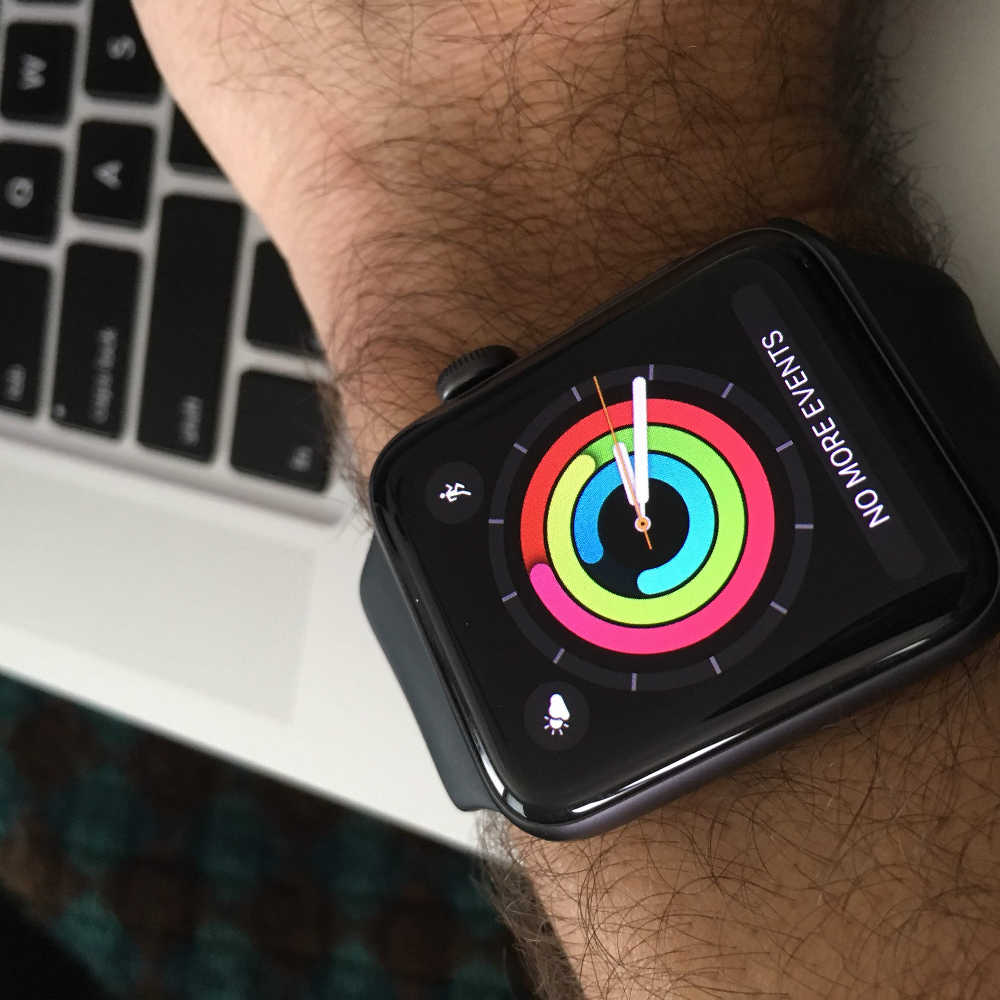
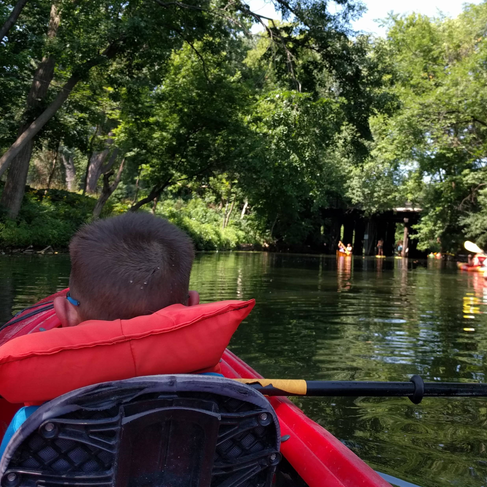

## Intro

❤️ Another year has come and gone...

and now I am looking forward to 2019. [While 2018 was a great year](https://frankpigeon.com/2018-year-in-review), I want to take the momentum I've built into the new year.

There is **nothing special about January 1st**, but many take this date to _signify a new start_, _a new beginning_. I started my New Years resolutions in November 2018 and found that I was starting all these new positive habits and I want to continue them in 2019.

## Habits, Not Goals

[If you haven't read Atomic Habits by James Clear, go check it out!](https://jamesclear.com/book/atomic-habits) It is definitely one of the greatest books of 2018 in my opinion.

> Goals are about the results you want to achieve. Systems are about the processes that lead to those results.

In the early chapters, James says to _forget about goals_ and **focus rather on the systems** that will get you to reach your goals.

> Goals are good for setting a direction, but systems are best for making progress.

I have set goals before and while I have reached many of them, I probably have failed to reach many more of them. Another problem is, what do you do _once you reach a goal_? Many just move onto the next thing. So instead of goals, I am going to focus on **habits**( aka systems) instead.

> 🔥You do not rise to the level of your goals. You fall to the level of your systems.

### 1. Spiritual Life

🕊️Putting God first is important. He has given me eternal life so I will start the day in His Word.

One of my daily morning habits is to **_read one Bible chapter everyday_** and also journal about it. God speaks though His Word and the more time you spend Him, the more you get to know God and can meditate on it throughout the day.

I started in Proverbs and then read Ecclesiastes. Now I have started reading Psalms.

### 2. Read More Books

I have read a bunch of books last year. I find that it exposes me to new ideas, makes me happy, and helps me wind down and get to sleep. This is something new for me since I had not read much in my thirties. I am finding that I would rather read than watch a movie.

❤️I love my [minimalist Kindle](http://www.rodrigofranco.com/MinimalKindle.html) reader since that is all it does. It allows you to consume books with no distractions. 😂Twitter is not a tab away.

Here are some books I have queued up on my Kindle.

- **Debugging Teams** by Brian Fitzpatrick
- **Lean from the Trenches** by Henrik Kniberg
- **Driving Technical Change** by Terrence Ryan
- **The New Body Type** by Eric Berg
- **Going Off the Grid** by Gary Collins
- **Flow** by Mihaly Csikszentmihalyi
- **12 Rules for Life** by Jordan Peterson
- **Crushing It** by Gary Vaynerchuck
- **Never Split the Difference** by Chris Voss

My kindle is on my nightstand so as I lay in bed it is right there _to remind me to read._ **My habit is to read 10 minutes before I go to bed.** I usually read much and have to be careful since I am in the #430club.

### 3. Physical Health

I have invested in an Apple Watch and find that its **Activities app** is great!

**My habit is to close my rings daily**.

I can usually get my 10K steps a day without too much effort but the hard one is to get the 30 minutes of exercise.

I am subscribed to [Daily Burn](https://dailyburn.com) so it removes all friction of getting to the gym. I just fire up the app, cast it to the tv, and I have a trainer and a program to do.

💪Bonus, my wife can join me and be my accountability partner.

### 4. Family Life

I strive for work-life balance. I have put my family through many trials and uncertainty but they have stayed by me through it all.

**My habit is to have a family activity every Saturday. The idea is something we can all enjoy together as a family and we all have to participate.**

Some ideas could be:

- ride bikes
- hike in the trails
- coding camp
- watch a movie
- game night

It doesn't have to be expensive or difficult. _Simplicity is the key._

### 5. Financial

As a Dave Ramsey fan, we are on Baby Step 2 of **The Total Money Makeover**. We had a lot of life thrown at us in 2017 and we are working on paying down our debt, sticking to a monthly zero-based budget, and a cash envelope system to help us stay on track.

🔥Old school but effective.

**My habit is to make monthly budgets, budget meetings with my wife, and review our debt snowball.**

### 6. Professional

👨‍💻JavaScript is where it's at for me.

I will continue to explore this language and its ecosystem. Work has been getting really exciting with more React projects, Gatsby for public facing websites, and GraphQL to interface with the data.

**The habit is to spend 10 minutes on a personal project, tutorial, or code challenge a day**. Practice, repetition, going deep on the fundamentals, and challenging myself is the way to hone my craft.

[I can check my commit log](https://github.com/fpigeonjr) to see if I am on track. Should be lots of green!

## Conclusion

🎉I am so excited to see what God has planned for 2019!

I am expecting that it is going to be a year full of miracles, blessings, and overflow. I am asking God for direction, that He be my roadmap in 2019. _Where do you want me to go Lord?_

> Even though I walk through the valley of the shadow of death,
> I will fear no evil,
> for you are with me;
> your rod and your staff,
> they comfort me.
> You prepare a table before me
> in the presence of my enemies;
> you anoint my head with oil;
> my cup overflows.
> Surely goodness and mercy shall follow me
> all the days of my life,
> and I shall dwell in the house of the Lord
> forever. - **Psalm 23:5**
