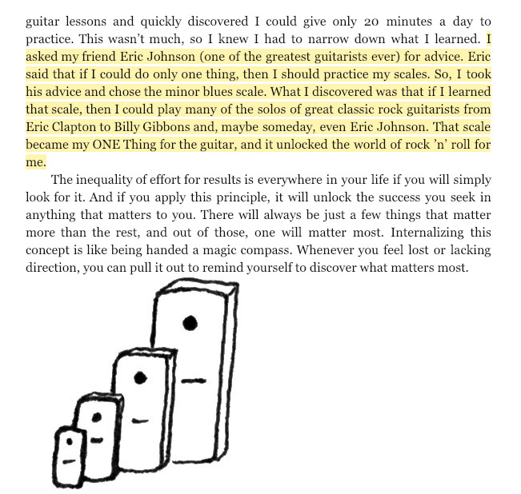

## Intro

I've been doing quite a bit of reading lately and came across the **80/20 rule** or the [**_Pareto's principle_**](https://en.m.wikipedia.org/wiki/Pareto_principle). It can be seen everywhere like in wealth distribution, books, song writers, etc. i.e. _80% of the land was owned by 20% of the people._

> The Pareto principle (also known as the 80/20 rule, the law of the vital few, or the principle of factor sparsity) states that, for many events, roughly 80% of the effects come from 20% of the causes.
>
> - Wikipedia

A specific example in the book **"The One Thing"**, the author wanted to be a better guitar player, so he asked his guitar teacher, "If I can only practice 20 minutes a day, what is the one thing I should practice?" **He chose the minor blues scale.**

So it got me thinking what would be the equivalent for web development? I asked our most productive developer in our office and this is what he said.

## Habits to be a Better Developer

### 1. Consistency

Consistency resonates with me a lot since reading **"Atomic Habits"** which is about making small habits to increase 1% every day to reach your goal. So being consistent could look like coding 10 minutes a day. Start easy but be consistent.

### 2. Create More

It is easy (_and default behavior_) to unwind and consume content on endless streams of data on the internet. Having a creator mindset helps in application of concepts and ideas. I love to watch coding tutorials but not applying what I've learned can lead to becoming rusty and losing what you have just learned. Countless mentors have always told me to always have a side project.

### 3. Passion

This is a hard one to describe but an important one. Finding a passion for coding can be different for everyone. Some things I find to keep my passion are keeping up with trends, reading blogs, listening to podcasts, and watching tutorials. This industry moves so fast. Trying out new libraries or frameworks can bring new life to your projects.

### 4. Release

After doing web development for years, it could lead to a path of burnout. Having a hobby outside of coding can bring help bring balance to your dev life. Hobbies that include things like music, exercise, and the arts can take your mind of the problems you're dealing with and can bring an escape.

> I think doing something with your hands helps. I play drums and I forget everything in the world and concentrate on playing songs. I really think that is part of it.

### 5. Fearless Approach

I fall into the trap of overthinking all the time.

- Is this the best approach
- am I going to have to rewrite this from scratch
- I am wasting too much time

But my co-worker says to be _fearless_.

> Sometimes its a fearless approach, i'm not worried about what I am coding I just utilize my skills and just do it.

You have to just start. Even if its just psuedo-code. Start. You can always refactor and refine later. Get your fingers moving on the keyboard.

> If there is something I need to code I don't necessarily worry about how hard it could be. I just try to break it down to smaller and smaller problems to solve. Then its not hard anymore.

🔥This is pure fire here. The ability to break down a big problem into smaller more manageable tasks is crucial. With smaller chunks to tackle, it seems not so overwhelming!

### 6. Don't Give Up

Inevitably you will run into a challenge in your code. Sometimes when I get stuck, I like to start another task and then return to the original challenge after not thinking about it for a while. Sleep is another great resource for getting unstuck. Surprisingly, your brain continues to work on the problem at a much faster rate than your conscious mind. I am always surprised on how easy I find a solution after getting some rest the next day.

> ...I don't ever give up on something I am trying to do. I might stop but I always come back.

### 7. Focus on Finishing

> Focus on finishing is a big one.

On big projects working on a team it's easy to get disorganized and lost.

- who is working on what
- what are the priorities
- what should we be focusing on

Staying organized with a kanban board (like trello) and assigning who is working on which tasks is extremely helpful to keep the product flowing smoothly.

Being able to visualize the flow, you can keep your eyes on the goal.

## Summary

Unpacking these ideas was very helpful for me, and I hope that you were able to gain some habits you could try out on your road to be a better developer.
