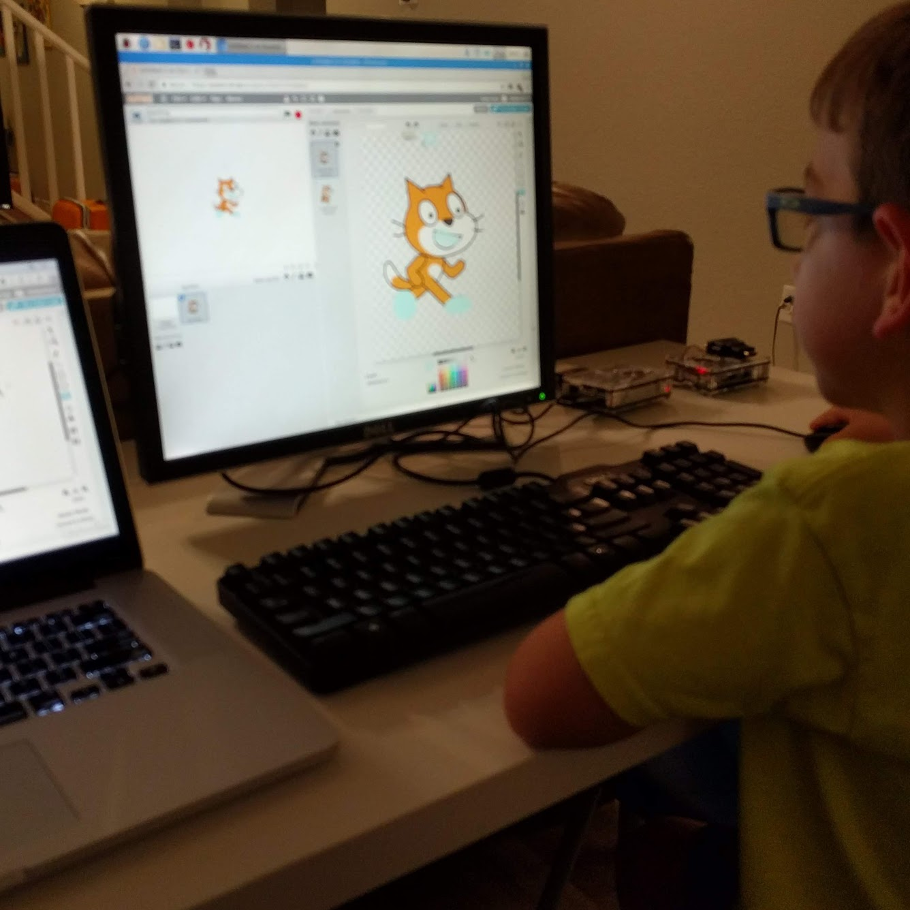
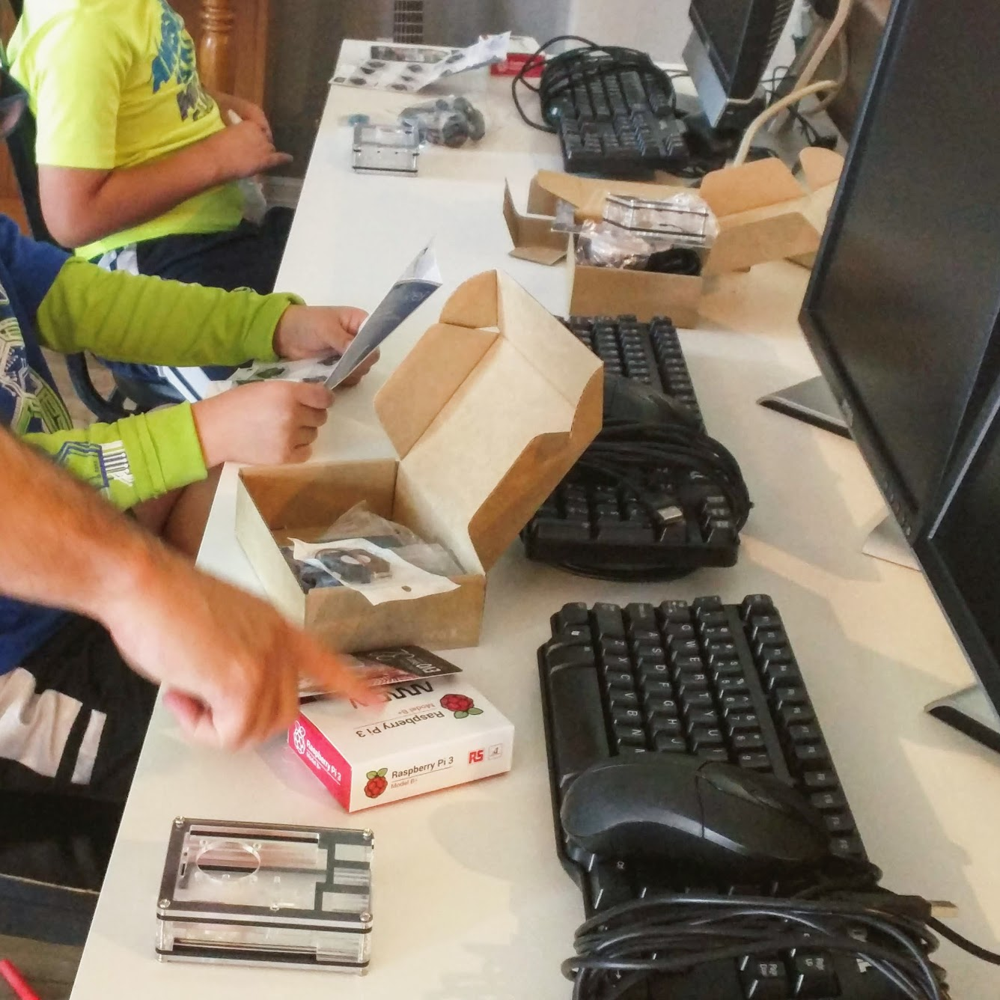
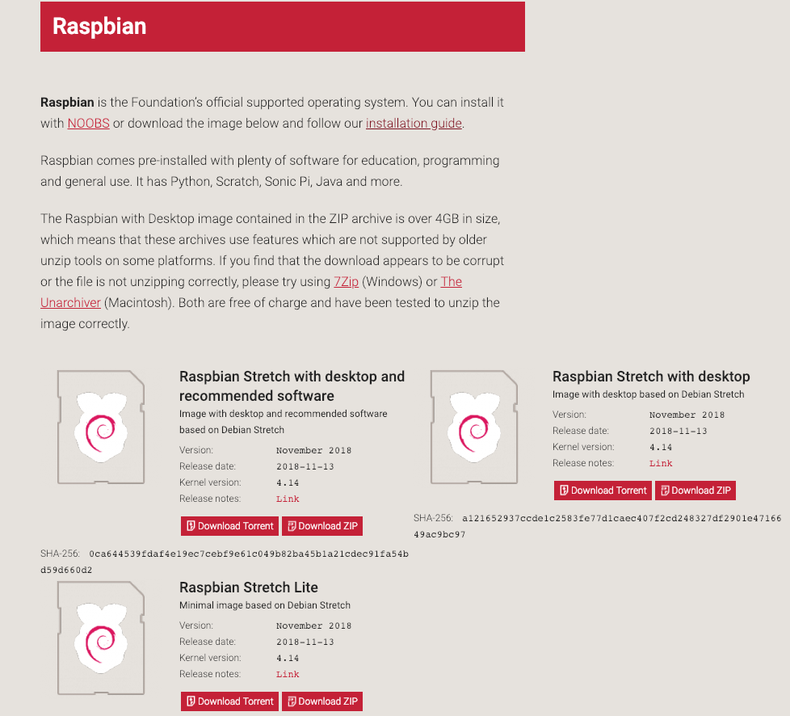
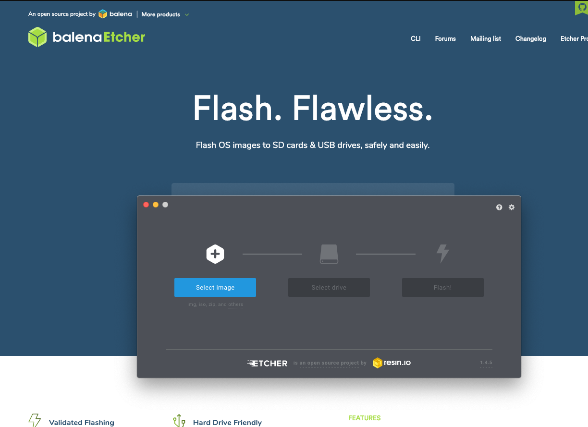
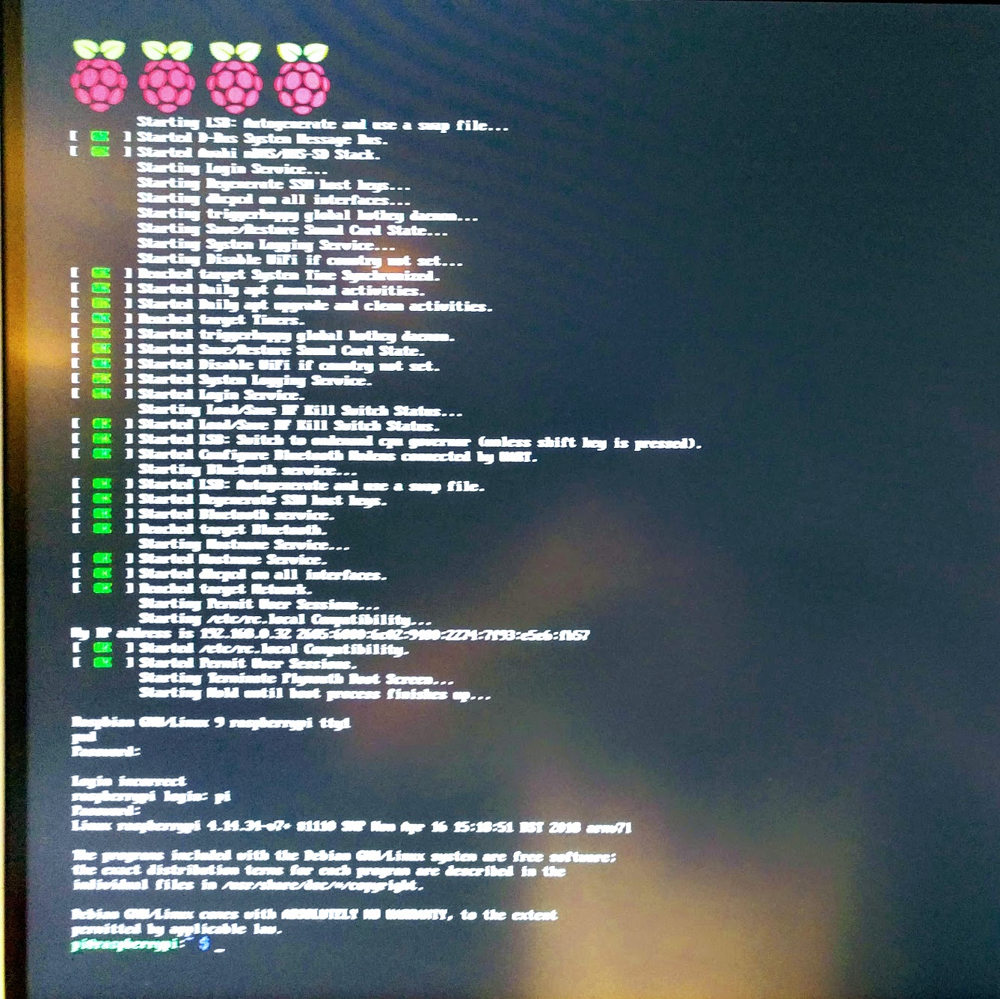
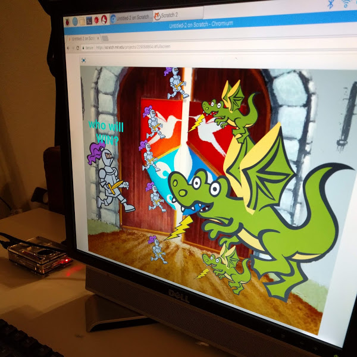
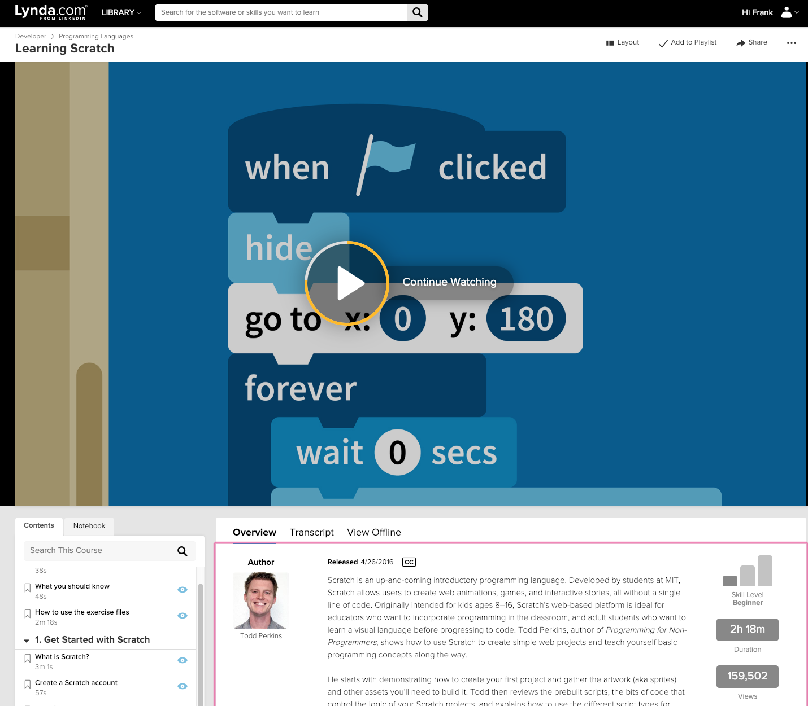

## Intro

I was reflecting on the coding camp we put together for the boys last summer.

> ❤️they had a blast learning, building, and **coding**

It was cool to find that my boys share a passion for creating, _just like their dad_.

## Hardware

I needed cheap hardware since at this point I didn't know if this would just be a phase.

💰I didn't want to spend more than \$100.

I had already put together a Raspberry Pi(rpi) for my home network (_which is a blog post on its own_). So I thought that this would be an excellent solution for my boys linux rig as well.

I found a BOGO offer on Pis from [Arrow Electronics](https://www.arrow.com/). While you can just [buy the entire kit from Amazon](https://www.amazon.com/gp/product/B01C6EQNNK/ref=oh_aui_search_asin_title?ie=UTF8&psc=1), these did not include the fans, case, or power adapter. So if your just looking for a case kit, [Amazon has those too](https://www.amazon.com/gp/product/B07BTHNW9W/ref=oh_aui_search_asin_title?ie=UTF8&psc=1).

So at the end of the day, you will need:

- Raspberry Pi
- Case
- Fan and Heatsinks(optional)
- Power Adapter
- SD Memory Card (8GB Minimum)
- Monitor
- Keyboard and mouse

## Software

In order to get an operating system on the Raspberry Pi, you will need an SD Memory card.

The os is over 4GB so they recommend a minimum of 8GB. However, [Amazon has 32GB memory card for under \$10](https://www.amazon.com/gp/product/B06XWN9Q99/ref=oh_aui_search_asin_title?ie=UTF8&psc=1).

1. The first step is to [download the os from the official raspberry website](https://www.raspberrypi.org/downloads/raspbian/).

2. Then you want to create the bootable os using [Etcher](https://www.balena.io/etcher/).

🔥Once its done, insert into your SD card into your rpi and fire it up!

## Coding

With the hardware and software working, we now come to what really matters. Why did we put all this stuff together?

🐙to learn to code

There is no better way to teach young children to code than [Scratch](https://scratch.mit.edu/).

> With Scratch, you can program your own interactive stories, games, and animations — and share your creations with others in the online community.
>
> Scratch is a project of the Lifelong Kindergarten Group at the MIT Media Lab. It is provided free of charge.
>
> -- Scratch About Page

[Lynda has a great intro to Scratch course](https://www.lynda.com/Scratch-tutorials/Scratch-Programming-Language-Basics/476623-2.html?srchtrk=index%3a1%0alinktypeid%3a2%0aq%3ascratch%0apage%3a1%0as%3arelevance%0asa%3atrue%0aproducttypeid%3a2) that the boys and I went through. It was a lot of fun. Some things we learned:

- patience
- backdrops and sprites
- animating objects
- reacting to events
- changing sprite costumes
- build a game
- share your game with other Scratch coders

## Conclusion

My boys enjoyed the Raspberry Pi boot camp, we lovingly called **_Daddy Camp_**.

> Pro-tip: Anytime you do an activity with your children in the summer just add camp to the end of it. You'll feel like your saving money.

We did a lot during Daddy Camp:

- build a raspberry pi
- hook up the peripherals
- install an operating system
- learn to code in Scratch

It was a success and I could clearly see that my boys enjoyed building stuff. I want to instill a creator's heart in them.

Best of all, we spend quality time together.
