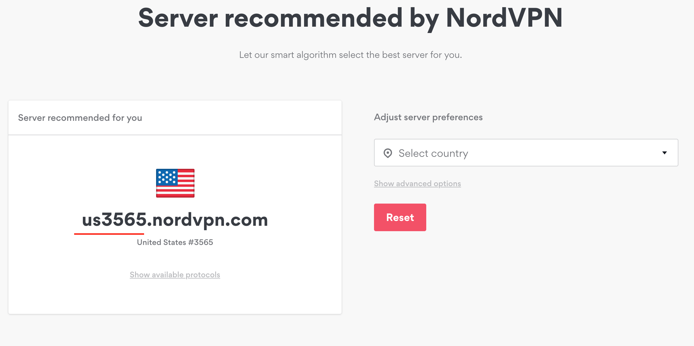
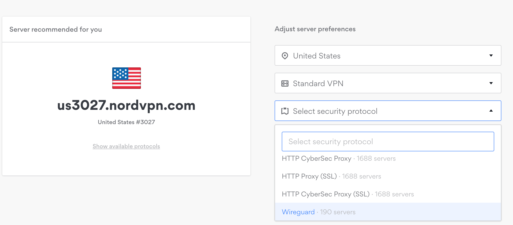

## Motivation

The world wide web is a dark and scary place. If you want to protect your privacy and resist the man, then a VPN(Virtual Private Network) may be for you.

Some benefits that a VPN provide are:

- Anonymity
- Overcoming Geo-Location challenges
- Increased Security

I was not happy when I got a slap on the wrist from my ISP saying that I had made a copyright infringement and to _cut it out_.

> If you have been copying, sharing, or otherwise using copyrighted content without the copyright owner's permission using your Internet service, we recommend you stop doing it immediately.

✊ They had my ip address and everything so it was time to fight back.

Here are some good articles on _why you may need a VPN_.

- [TunnelBear](https://www.tunnelbear.com/blog/always-use-a-vpn/)
- [Mashable](https://mashable.com/article/why-you-need-vpn/)
- [How-To-Geek](https://www.howtogeek.com/133680/htg-explains-what-is-a-vpn/)

## Lots of VPN Options

I started researching VPN options and found of a few subreddits with people raving about certain VPN providers.

**NordVPN** had been a stand out from this [sub-reddit](https://www.reddit.com/r/VPNTorrents/comments/as2cgo/whats_the_best_vpn_for_torrenting/).

[PC Mag](https://www.pcmag.com/roundup/354396/the-best-vpns-for-bittorrent) also did a great article comparing major VPN providers.

[BearTunnel](https://thewirecutter.com/reviews/best-vpn-service/) even won best VPN on wirecutter.com for best VPN service.

The ultimate showdown between[TunnelBear vs NordVPN](https://pixelprivacy.com/vpn/reviews/nordvpn-vs-tunnelbear/).

After researching several options I ended up choosing [**NordVPN**](https://go.nordvpn.net/aff_c?offer_id=15&aff_id=3363&url_id=902) because:

- 🇵🇦based in Panama
- 🌱[tons of servers](https://nordvpn.com/servers/tools/)
- ☠️[killswitch feature](https://nordvpn.com/features/kill-switch-technique/)
- 🐧[linux client](https://support.nordvpn.com/Connectivity/Linux/1325531132/Installing-and-using-NordVPN-on-Debian-Ubuntu-and-Linux-Mint.htm)
- 💪[wireguard support](https://nordvpn.com/blog/nordlynx-protocol-wireguard/)
- [🎅has an amazing sale going on](https://go.nordvpn.net/aff_c?offer_id=15&aff_id=3363&url_id=902)

## Install

This guide is for **Ubuntu 18.04** and **NordVPN** but should work for any Debain-based system.

After you have signed up with NordVPN, make sure you have your credentials handy. You will need them soon.

First thing you do is pull down the latest NordVPN file from their site.

1. You'll want to be somewhere like your **Downloads** directory.

   ```bash

   cd ~/Downloads

   ```

2. Pull down the file from NordVPN.

   ```bash

   sudo wget -qnc https://repo.nordvpn.com/deb/nordvpn/debian/pool/main/nordvpn-release_1.0.0_all.deb

   ```

3. More linux magic.

   ```bash

   sudo dpkg -i ./nordvpn-release_1.0.0_all.deb

   ```

4. Next, update your package list.

   ```bash

   sudo apt update

   ```

5. Now install NordVPN.

   ```bash

   sudo apt install nordvpn

   ```

6. (optional) If step 5 doesn't work for you _(like in my situation)_, try this:

   ```bash

   sudo wget https://repo.nordvpn.com/gpg/nordvpn_public.asc -O - | sudo apt-key add -

   sudo apt install nordvpn

   ```

🎉Now you should have access to the `nordvpn` command!

## Basic Configuration

Now that you have NordVPN installed, let's test run thru the basics to get connected to a VPN server.

1. First step is to login with your NordVPN credentials.

   ```bash

   nordvpn login

   ```

2. Once your logged in, connect to a generic server.

   ```bash

   nordvpn connect(c)

   ```

   If you want to configure to a specific server, check out their [server list](https://nordvpn.com/servers/tools/).



1. In my example, server `us3565` was the server recommended for my location. To connect with this specific server run:

   ```bash

   nordvpn connect us3565

   ```

2. To confirm that you are connected

   ```bash

   nordvpn status

   ```

3. When you are ready to disconnect

   ```bash

   nordvpn disconnect(d)

   ```

## Advanced Configuration

😢Bummed out that your VPN slows down your connection?

The NordVPN team has been working on project NordLynx which uses a new protocol called _wireguard_ that is going to knock your socks off.

[This PCMag article gives you all the details](https://www.pcmag.com/commentary/369921/the-vpn-industry-is-on-the-cusp-of-a-major-breakthrough).

> 🔥And the numbers don't lie (credit PC Mag)


To take advantage of NordLynx, follow the following steps from the [NordVPN site](https://nordvpn.com/blog/nordlynx-protocol-wireguard/).

### Install WireGuard

```bash

sudo add-apt-repository ppa:wireguard/wireguard
sudo apt update
sudo apt install wireguard
nordvpn set technology nordlynx

```

In my tests, I went from **80mbps** _(udp)_ to over to **250mbps** using _nordlynx_.

I have a fiber connection and without VPN on, I get around **350mbps up and down**.

> 🚀Very impressive indeed

Make sure you select a custom server that has the wireguard option.



### Killswitch

I like this option to prevent me getting back on my ISP if I was to get disconnected.

> Kill switch is a technique that helps you prevent unprotected access to the internet, where your traffic doesn't go through the VPN.

```bash

nordvpn set killswitch on

```

### CyberSec

> [CyberSec](https://support.nordvpn.com/General-info/Features/1047407402/What-is-CyberSec.htm) protects you from ads, unsafe connections and malicious sites.

```bash

nordvpn set cybersec on

```

## Conclusion

I am happy that I have found a vpn client that is as flexible, secure, and cutting-edge as NordVPN.

I feel more protected and secure on my all my journeys on the web.

Hope this guide will help you as much as it may help me in the future.

> 😃#bekindtoyourfutureself

## Resources

- [NordVPN Ubuntu Guide](https://support.nordvpn.com/Connectivity/Linux/1325531132/Installing-and-using-NordVPN-on-Debian-Ubuntu-and-Linux-Mint.htm)
- [NordVPN Server List](https://nordvpn.com/servers/tools/)
- [IP Leak](https://ipleak.net/)
- [NordVPN Sign Up](https://go.nordvpn.net/aff_c?offer_id=15&aff_id=3363&url_id=902)
