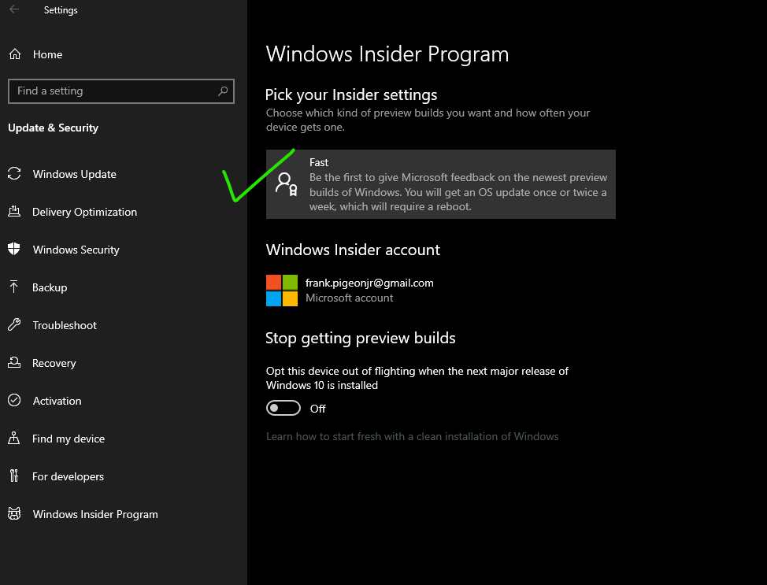

## Background

So it was a big weekend for Apple fans as Apple launched Catalina and I was excited to get my 2012 macBook Pro updated to latest operating system.

> I was thinking why not upgrade my desktop to a Hackintosh?

Not sure what I was thinking but it didn't go well for me. After tweaking BIOS,  and creating a bootable USB drive with Catalina, all I could get was a dreaded black screen with a blinking cursor.

> 🤷‍♂ oh the sadness

So I decided to give **Windows 10** a shot now that [WSL(Windows Subsystem for Linux)2](https://docs.microsoft.com/en-us/windows/wsl/wsl2-install) was available.

## Getting Started

First off you'll need to be running *Windows 10 build 18917* or higher. At the time of this post, the only way to get there was by joining the *Windows Insider Program* and joining the **Fast Ring**. 



You can check your Windows version by opening Command Prompt and running the `ver` command.

```bash

ver // Microsoft Windows [Version 10.0.18999.1]

```


Next you'll want to enable the *'Virtual Machine Platform'* optional component and make sure WSL is enabled.

Open *PowerShell as an Administrator* and run:

```powershell

Enable-WindowsOptionalFeature -Online -FeatureName VirtualMachinePlatform
Enable-WindowsOptionalFeature -Online -FeatureName Microsoft-Windows-Subsystem-Linux

```

This will cause a reboot.

I wanted to make WSL 2 the default architecture so you'll want to: 

Open *PowerShell as an Administrator* and run:

```powershell

wsl --set-default-version 2

```

You'll want to grab a linux distro from the MS Store. I went with Ubuntu since that is the one I am most familiar with.


> And when done, select Launch to get started. This will open a Linux terminal and complete the installation. You’ll need to create a user ID and password since we’re setting up a full Linux instance, but once that’s done, boom! You are running Linux on Windows.

## Resources

[WSL 2 Docs](https://docs.microsoft.com/en-us/windows/wsl/wsl2-index)

