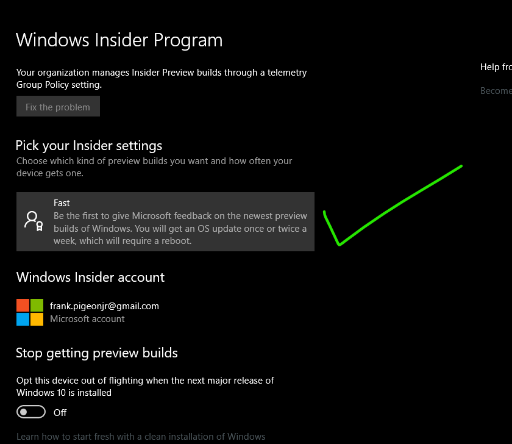
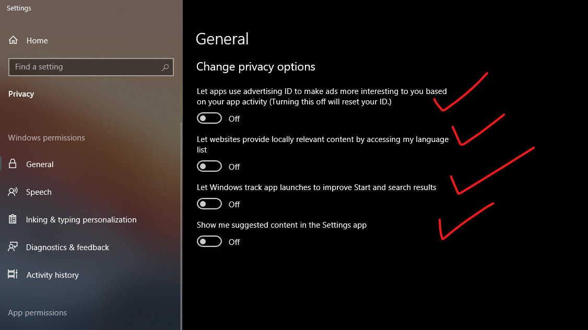
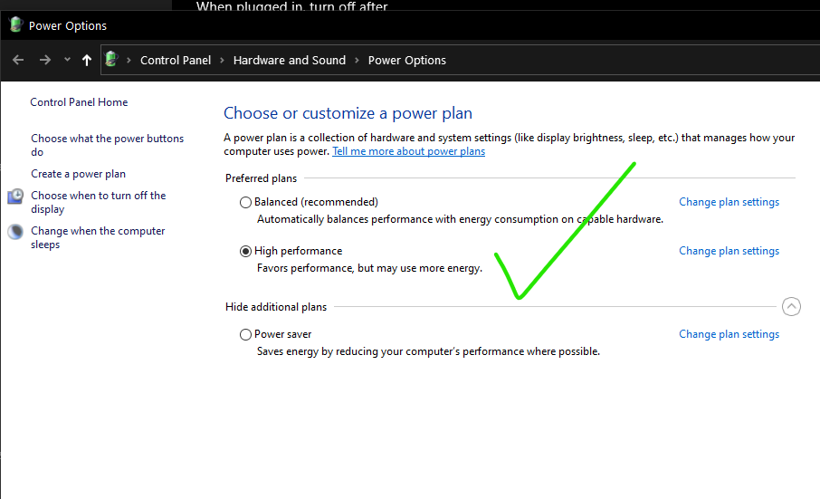
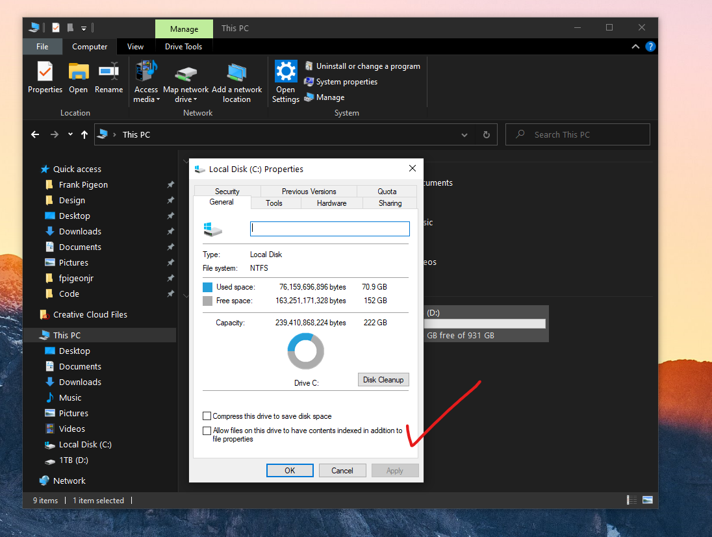
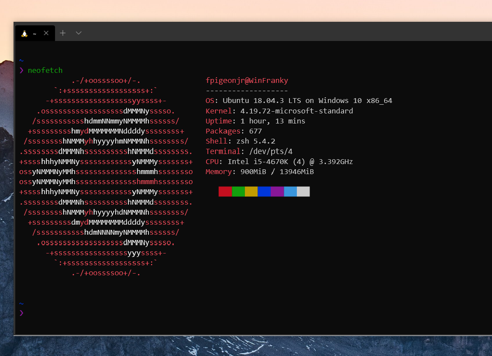
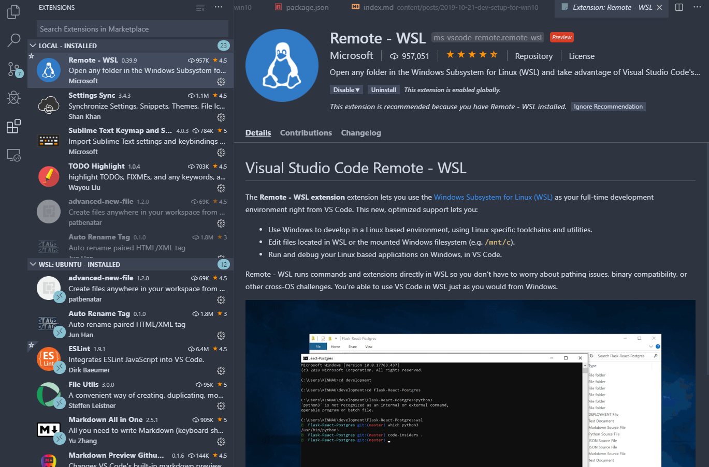
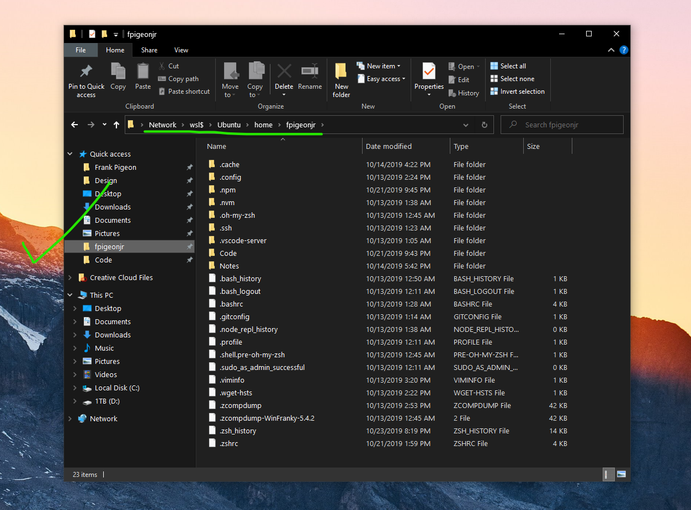

> This is how I setup windows 10 for a modern web development using Windows Subsystem for Linux (WSL2).
> I am coming from macOS so my goal is to get as close as my setup on my macBook Pro for web development.

<iframe width="560" height="315" src="https://www.youtube.com/embed/A0eqZujVfYU" frameborder="0" allow="accelerometer; autoplay; encrypted-media; gyroscope; picture-in-picture" allowfullscreen></iframe>

## Overview

1. Windows 10 Setup
2. Web Development Setup
   - Package Manager
   - App Launcher
   - WSL 2
   - Visual Studio Code - WSL extension
3. Moving Files from Windows to Linux

## Windows 10 Setup

### Windows Updates

At the time of this writing _WSL2_ is only available on the _Insiders Build-Fast_ so you will have to jump to the bleeding edge of Microsoft has to offer.

- Insiders Build - Fast
- run all updates



### Debloat Script

Next you'll want to run the [Windows10 Debloat Script](https://github.com/Sycnex/Windows10Debloater) which will (as the name implies)remove a bunch bloat and make Windows snappier.


<p style="font-size: smaller">- gif created by <a href="https://azraelsdomain.tech/" > Paul Castillo</a></p>

> 👋bye bye Candy Crush

[https://github.com/Sycnex/Windows10Debloater](https://github.com/Sycnex/Windows10Debloater)

<p style="font-size: smaller">⭐go star the project now</p>

- yes debloat
- remove all preinstalled
- no to pdf
- no to oneDrive
- unpin all items

> ❗Say No to reboot, there are more tweaks to go

### Privacy Settings

👀Since we don't Windows spying on us, we'll go ahead and turn off all the following provacy settings.



- General Tab -> all off
- Speech -> off
- Inking -> off
- Diagnostics -> off
- Activity History -> off
- Location -> off
- Background Apps -> off
- App Diagnostics -> off

### Power Settings

Get more turbo-boost from your PC by turning on the high performance setting in your power settings.



- High Performance

### Disable File Indexing



Warning, this takes a while but will make your system even snappier.

- Turn off for Local Disk.(may take a while)

### Reboot

> 🤣Time for a reboot, what did you expect...it's still Windows.

## Development Setup

### Package Manager


Homebrew(Mac's package manager) alternative on Windows is called Chocolatey. So go ahead and get some `choco love`.

[Chocolatey - The Package Manager for Windows](https://chocolatey.org/)

`> choco install all my apps`

> 🛑Here you will want to install your client side apps, but not any development specific ones like git, node, or python. **We'll install those on the linux.**

Here are some of packages I use all the time:

- **firefox** - modern browser with great dev tools
- **microsoft-windows-terminal** - new terminal from Microsoft
- **cascadiacode** - monospaced coding font
- **7zip** - compression tool
- **vlc** - media player
- **vscode** - code editor
- **bitwarden** - password manager

🔥And you can install them all in one go like this:

```bash

choco install firefox microsoft-windows-terminal cascadiacode 7zip vlc vscode bitwarden

```

### App Launcher

On Mac you have _spotlight_ to quickly search files, launch apps, confiure settings, etc.

The Windows alternative is called WoX.

> WoX is a launcher for Windows that simply works. It's an alternative to Alfred and Launchy. You can call it Windows omni-eXecutor if you want a long name.


[https://github.com/Wox-launcher/Wox](https://github.com/Wox-launcher/Wox)

Install it from chocolately:

`choco install wox`

### WSL 2



[I wrote a separate blog post on this](/wsl2-on-windows10) but here are the cliff notes:

- Enable WSL running by PS Script
- Run both, one at a time, then reboot
- Set WSL default to WSL2
- Get linux distro of choice via MS Store, had some issues via chocolatey.
- (I went with Ubuntu)
- On launch, set userid and password.
- Update Ubuntu
- `sudo apt update && sudo apt upgrade -y`

### Visual Studio Code Remote - WSL extension



You'll want this vscode extension to live in both worlds. It allows you to install linux-specific extensions from the Marketplace and spinning up your linux server seamlessly.

### Ubuntu setup

In linux, you'll want to install your developer tools like `git, node via nvm, python, etc.`

Once I have node setup I add these from npm.

`npm install -g eslint, gatsby-cli, create-react-app`

Honorable mentions

Make your terminal sexy with:

`zsh, oh-my-zsh, zsh-syntax-highlighting, nvm-zsh`

I will be writing another blog post on setting up your linux terminal.

## Moving Files from Windows to Linux

A common problem is how to get files from your Windows client onto the linux side.

> ie. You worked on some images for your website in Photoshop and need to copy over to the linux code base.

Run the following command from your linux home directory or code directory on the linux terminal and it will open up File Explorer.

```bash

explorer.exe .

```



I recommend pinning this directory since you will want to move project assets from the Windows side to linux.

## Microsoft Updates

Microsoft updates the Insiders Build pretty frequently and with the [win10debloater script](https://github.com/Sycnex/Windows10Debloater) defaults telemetry is turned off (which is probably a good default).
I wanted to update Windows and it wasn't seeing any updates so here is what I did to allow for updates to be installed based on this [github issue](https://github.com/Sycnex/Windows10Debloater/issues/122).

>Open the Start Menu. Type in `gpedit.msc` and right-click the app from the search results. Choose `Run as Administrator` from the context menu.

> In the `Group Policy Editor`, go to `Computer Configuration/Administrative Templates/Windows Components/Data Collection and Preview Builds`.

> Find the `Allow Telemetry` item and double-click it to edit the policies. Change the setting to `Enabled`. Change the drop-down menu entry to `3 - Full` and click Apply. 

Now you should be able to run Microsoft Updates normally. After the updates run and your mandatory reboot re-enable the telemetry setting .

> Now open the item again and change the Setting to `Not configured` and hit the Save button.


## Final Thoughts

It's an exciting time to be a developer on Windows. With WSL2, you will get the great developer experience of linux and access to very popular Windows ecosystem. It's the best of both worlds.

## Resources

[Chris Titus Tech - Setting up the perfect Windows 10 Installation | Faster, Lighter, and Functional](https://youtu.be/nVy4GAtkh7Q)

[MS Docs for WSL2](https://docs.microsoft.com/en-us/windows/wsl/wsl2-install)

[MS Docs for Setting up Node w/ WSL2](https://docs.microsoft.com/en-us/windows/nodejs/setup-on-wsl2)
