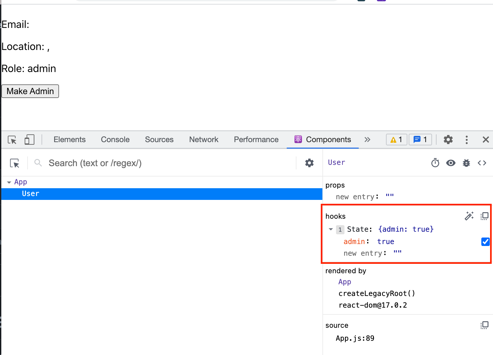

> Teach everyone to spread, they'll spead for a day. Teach everyone to useReducer and they'll spread for life.
>
> Eve Porcello author of Learning React


<!-- image of book -->

In Chapter 7 of **Learning React**, I came across a great example for useReducer, one of React's new hooks.

According to the docs, `useReducer is usually preferable to useState when you have complex state logic that involves multiple sub-values or when the next state depends on the previous one.`

## Setup

This is an example from the book. Let's say we have a user object. We want the ability to add them as an admin by clicking on the **Make Admin** button.

```javascript
const firstUser = {
  id: '1230123-123',
  firstName: 'Bill',
  lastName: 'Wilson',
  city: 'Missoula',
  state: 'Montana',
  email: 'bwilson@mtnwilson.com',
  admin: false,
}

function User() {
  const [user, setUser] = React.useState(firstUser)

  return (
    <div>
      <h1>
        {user.firstName} {user.lastName}
      </h1>
      <p>Email: {user.email}</p>
      <p>
        Location: {user.city}, {user.state}
      </p>
      <p>Role: {user.admin ? 'admin' : 'user'}</p>
      <button
        onClick={() => {
          setUser({ admin: true })
        }}
      >
        Make Admin
      </button>
    </div>
  )
}
```

The mistake on the button onClick() method is that by using `setUser({admin: true})` is that this will overwrite the object and you'll lose the id, firstName, lastName, city, state, and email key/value pairs. It will only write the admin key/value pair. Not what we want.



## The Fix

To fix this, we can instead spread the array first and then add the key/value we want changed.

```javascript
<button
  onClick={() => {
    setUser({ ...user, admin: true })
  }}
>
  Make Admin
</button>
```

## Here is the new paradigm.

Instead we can use React's new hook useReducer. This sends the new state value, **NewDetails** to the reducer and it is pushed into the object.

```javascript
function User() {
  const [user, setUser] = React.useReducer(
    (user, newDetails) => ({
      ...user,
      ...newDetails,
    }),
    firstUser
  )
```

and return to the button to the initial setup.

```javascript
<button
  onClick={() => {
    setUser({ admin: true })
  }}
>
  Make Admin
</button>
```

## Final Thoughts

I like this new pattern and it makes it less likely to make errors when you come back at look at your code in the future. Remember to be kind to your future self. If you haven't picked up Eve Porcello's book **Learning React**, do yourself a favor and pick it up today.
