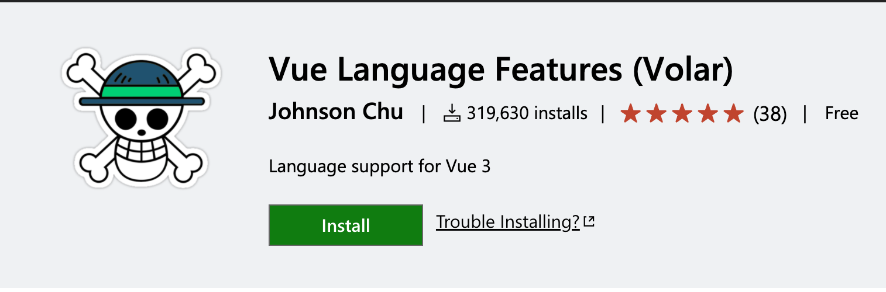
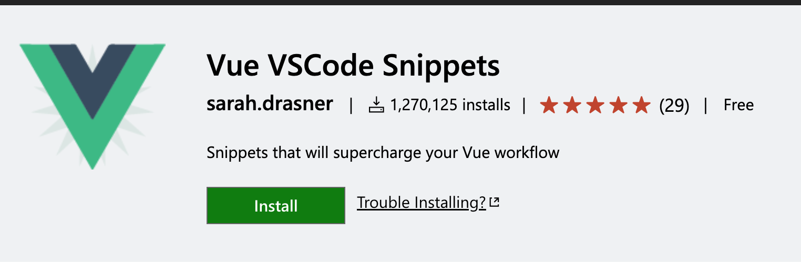
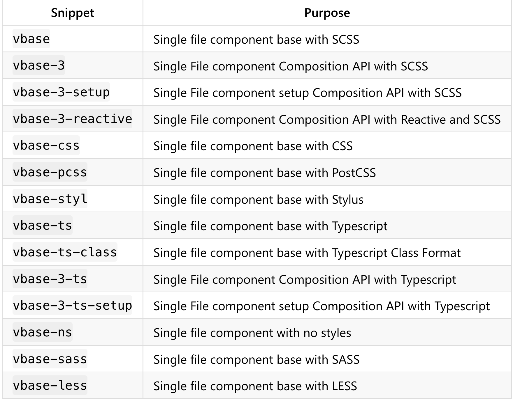
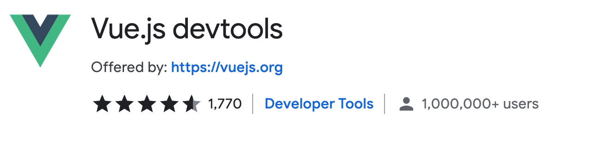

Vue is an amazing javascript framework to work in but how do you get started...especially coming from React?

## Intro

At work I have been assigned on a Vue project and coming from React there was a lot to learn. This is my attempt to capture my thoughts and notes on what you will need to be a productive Vue developer.

## Vue Ecosystem from Evan You

<iframe width="560" height="315" src="https://www.youtube.com/embed/2KBHvaAWJOA?start=50" title="YouTube video player" frameborder="0" allow="accelerometer; autoplay; clipboard-write; encrypted-media; gyroscope; picture-in-picture" allowfullscreen></iframe>

Watching Evan's keynote will bring you up to speed on where the Vue Ecosystem is at...but it's pretty long here are my takeaways.

- Vue3 will use [Vite](https://vitejs.dev/) by default
- [Vite](https://vitejs.dev/) is a build tool and dev server (and way faster than Webpack and is framework agnostic)
- [`npm init vue`](https://github.com/vuejs/create-vue) is the new way to create Vue apps
- [Volar](https://marketplace.visualstudio.com/items?itemName=johnsoncodehk.volar) is the new recommended vscode extension for Vue3 and provides 1st class TypeScript Support
- [Pinia](https://pinia.vuejs.org/) is the new global state management library aka vue store
- [Vue DevTools 6.0](https://devtools.vuejs.org/) extension for browser
- [script setup default in docs for composition api](https://vuejs.org/api/composition-api-setup.html#basic-usage) and will increase developer experience
- new docs site build with [vitepress](https://vitepress.vuejs.org/)

## Learning Vue

Now that you have a lay of the land in Vue it's time to learn how Vue works and get coding. I learn best by watching video tutorials and coding along.

Here are some video courses I have enjoyed:

- [Vue 3](https://pro.academind.com/p/vue-3-the-complete-guide?ref=madewithvuejs.com) by Academind (Udemy)
- [Nuxt.js - Vue.js on Steroids by Academind](https://www.udemy.com/course/nuxtjs-vuejs-on-steroids/) (Udemy)
- [Academind](https://www.youtube.com/c/Academind) (Youtube)
- [Vue Mastery](https://www.youtube.com/c/VueMastery) (Youtube)
- [Program With Eric](https://www.youtube.com/c/ProgramWithErik) (Youtube)

Other recommendations from [Made With Vue](https://madewithvuejs.com/blog/learn-vue-3-best-resources).

## Vue Dev Tools

### VSCode Extensions

💪 These are the vscode extensions recommended for Vue development.

1. [Volar Language Features](https://marketplace.visualstudio.com/items?itemName=johnsoncodehk.volar)

   Volar provides Vue syntax highlighting, TypeScript support, and works with Vue3 and Vue2.

2. [Vue Snippets](https://marketplace.visualstudio.com/items?itemName=sdras.vue-vscode-snippets)

   Vue snippets allow you to quickly scaffold out a Vue single file template and speed up your workflow.

   
   

### Browser Developer Tools

> Browser devtools extension for [debugging Vue.js applications](https://devtools.vuejs.org/)

This is a key part of developing Vue apps by giving you the ability to look at state, props, store, etc in the browser.

Support for [Chromium-based](https://chrome.google.com/webstore/detail/vuejs-devtools/nhdogjmejiglipccpnnnanhbledajbpd) browsers and [Firefox](https://addons.mozilla.org/en-US/firefox/addon/vue-js-devtools/).

## Summary

It's been a great experience learning a new javascript framework like Vue. It has a great ecosystem, team, and community. The developer experience is really good and I hope to continue learning and using Vue on personal and work projects.

Let me know if I missed some of your favorite Vue developer tools. 